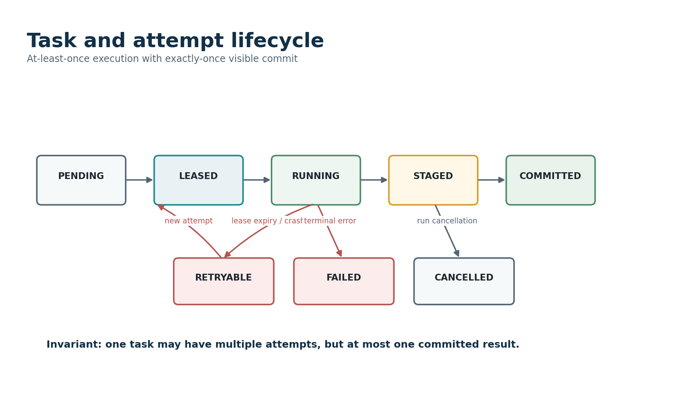
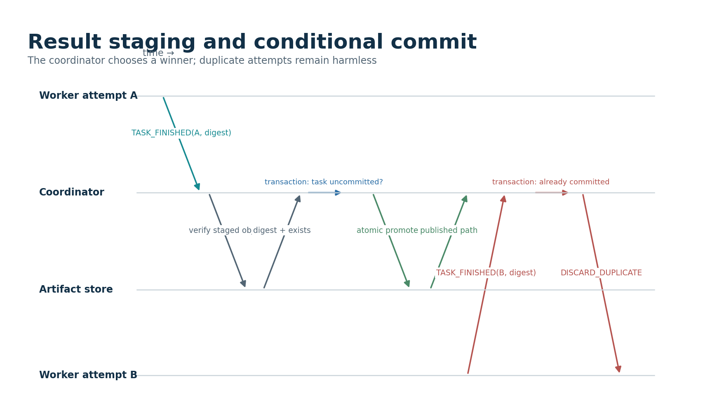

# Part II - Execution Model, Vocabulary, and Semantic Guarantees

## 14. Semantic Design Principles

- Immutable inputs and append-only evidence are easier to reason about than mutable shared state.
- Task execution may repeat; visible result publication must be conditional and idempotent.
- A lease grants temporary authority, not ownership forever. A fencing token makes stale authority detectable.
- The coordinator metadata transaction is authoritative for run and commit state. Worker messages are proposals or observations.
- Wall-clock time is for human timestamps; monotonic time is for local deadlines. Durable recovery must not depend on a monotonic timestamp surviving process restart.
- Determinism is a contract covering partitioning, random seeds, function identity, merge order, and normalized output---not merely the absence of threads.
- Cancellation is a state transition with a race policy, not an exception thrown wherever convenient.
- Every semantic guarantee must name its boundary. Forge can guarantee one committed result record per task without guaranteeing that external side effects run only once.

## 15. Canonical Vocabulary

**Table 9 --- Canonical execution vocabulary.**

  ----------------------------------------------------------------------------------------------------------------------------------------------------
  Term                           Definition
  ------------------------------ ---------------------------------------------------------------------------------------------------------------------
  Dataset                        An immutable logical collection of event records described by a versioned manifest.

  Dataset file                   A concrete immutable file containing a header and fixed-size or framed records.

  Experiment                     A user description of dataset, kernel, parameters, seed, partition policy, merge policy, and execution options.

  Run                            A durable execution instance created from a validated experiment manifest.

  Run manifest                   The canonical, immutable description of all inputs and choices that define a run.

  Partition                      A deterministic logical slice of a dataset, identified independently of any worker.

  Task                           A durable unit of required work, normally one kernel invocation for one partition and stage.

  Attempt                        One physical execution of a task. A task may have several attempts over time.

  Lease                          A time-limited coordinator grant allowing one worker attempt to execute and report completion.

  Fencing token                  A monotonically increasing value attached to a lease; stale attempts cannot renew or commit with an older token.

  Worker                         A process that advertises capabilities, requests work, executes trusted kernels, stages output, and reports status.

  Kernel                         A versioned registered computation implemented in Python or C++ and invoked against a partition.

  Stage                          A named phase of a run. The baseline has map tasks and one deterministic merge/finalize stage.

  Staged result                  Attempt output that exists and has a digest but is not yet the visible result for the task.

  Committed result               The one staged result selected by a durable conditional metadata transaction.

  Artifact                       An immutable dataset, staged output, committed output, checkpoint, report, or evidence file.

  Checkpoint                     A manifest identifying durable run progress and artifacts sufficient to resume or inspect a run.

  Canonical digest               A stable hash over normalized logical content, excluding run-specific metadata that should not affect equivalence.

  Diagnostic bundle              A portable collection of manifests, configuration, state, logs, metrics, and references needed for investigation.
  ----------------------------------------------------------------------------------------------------------------------------------------------------

## 16. Identity and Identifier Rules

Identifiers should be opaque in APIs but structured enough for logs and storage. The baseline may use UUIDv7 or another sortable unique identifier for runs, workers, tasks, and attempts, while partition IDs are deterministic within a run. Do not derive authority from identifier ordering.

**Table 10 --- Identifier creation and stability rules.**

  ----------------------------------------------------------------------------------------------------------------------------------------------------------------------------------
  Identifier        Creation                                Stability                                      Required properties
  ----------------- --------------------------------------- ---------------------------------------------- -------------------------------------------------------------------------
  dataset_id        Content or manifest registration        Stable across runs                             Refers to one immutable manifest version; optionally content-addressed.

  experiment_id     Client or coordinator                   Stable for one canonical experiment manifest   Useful for deduplication but not required to imply a run exists.

  run_id            Coordinator transaction                 Stable for run lifetime                        Unique, durable before task creation, included in all evidence.

  partition_id      Deterministic planner                   Stable for run manifest                        Derived from ordered plan index or canonical boundaries.

  task_id           Coordinator planner                     Stable across retries                          Uniquely identifies stage plus partition plus run.

  attempt_id        Coordinator on lease                    Unique per physical execution                  Never reused after terminal attempt state.

  worker_id         Worker installation or startup policy   Stable according to deployment mode            Distinct from PID and network address.

  lease_token       Coordinator                             Unique per lease generation                    Carries monotonic fencing_generation for stale-work rejection.

  artifact_digest   Writer after close                      Content-derived                                Calculated over exact bytes with named algorithm and schema.
  ----------------------------------------------------------------------------------------------------------------------------------------------------------------------------------

## 17. Run Manifest Contract

The run manifest is the central reproducibility artifact. It is immutable after acceptance. Mutable progress belongs in metadata tables and checkpoint manifests, not in the canonical run definition.

    schema_version: forge.run.v1
    run_id: 0190d9c6-...
    created_utc: 2026-07-22T20:10:00Z
    dataset:
      manifest_uri: artifacts/datasets/telemetry-100m/manifest.json
      manifest_sha256: 7e0d...
    kernel:
      id: telemetry.sum_by_stream
      implementation: cpp
      version: 1.3.0
      package_sha256: 34ab...
    parameters:
      min_timestamp_ns: 0
      include_event_types: [1, 2, 7]
    partitioning:
      strategy: contiguous_records
      target_records: 1000000
      planner_version: 1
    merge:
      strategy: ordered_reduce
      version: 1
    reproducibility:
      seed: 42017
      python: '3.12'
      cpp_standard: '20'
      forge_commit: 81c2f7a
    execution:
      max_attempts: 3
      lease_seconds: 30
      worker_concurrency: 1
      durability: metadata_and_artifacts

- Canonicalize the manifest before hashing: sorted object keys, normalized numeric forms, UTF-8 encoding, no comments, no environment-specific absolute paths, and explicit schema version.
- Reject unknown required fields, unsupported versions, negative limits, inconsistent dataset digests, unknown kernels, and parameters that fail kernel-specific validation.
- Record software identity precisely enough to reproduce a result. A branch name such as main is not an immutable version.
- Do not include worker count in the logical result digest unless the experiment semantics intentionally depend on parallelism.
- Preserve the accepted manifest byte-for-byte as an artifact and expose its digest in run status.

## 18. Dataset Immutability Contract

- A registered dataset manifest may not silently change. If any file, schema, checksum, record count, or ordering changes, create a new dataset version or ID.
- Readers must verify header fields and optionally verify file checksums according to the selected validation mode before task execution.
- Partition boundaries refer to logical record indices or byte ranges whose interpretation is defined by the dataset schema version.
- A worker must not edit source files, write temporary data into the dataset directory, or infer success from file modification time.
- The synthetic dataset generator must be deterministic from explicit parameters and seed, and it must emit its own generation manifest.
- Public sample datasets must contain no personal, proprietary, or restricted information.

## 19. Partition Contract

A partition is a logical claim about input boundaries, not a file copied for each task. The same partition plan must be usable by the reference path, Python workers, C++ workers, retries, and recovery.

**Table 11 --- Partition descriptor fields.**

  --------------------------------------------------------------------------------------------------------------------------------------------
  Field                   Meaning                                  Constraint
  ----------------------- ---------------------------------------- ---------------------------------------------------------------------------
  partition_id            Stable identifier within the run         Unique and deterministic.

  ordinal                 Position in canonical merge order        Dense integer beginning at zero.

  file_id                 Referenced dataset file                  Must exist in accepted dataset manifest.

  record_start            First logical record index               Inclusive and non-negative.

  record_count            Number of records                        Positive except for explicitly supported empty datasets.

  byte_start              Optional optimized byte boundary         Must agree with schema and logical indices.

  byte_length             Optional byte span                       Must not cross file boundary unless schema permits.

  partition_seed          Derived deterministic seed               Computed from run seed and partition identity with a documented function.

  expected_input_digest   Optional slice or file integrity value   Verified according to validation mode.
  --------------------------------------------------------------------------------------------------------------------------------------------

- The baseline planner uses contiguous record ranges and avoids splitting a record.
- Planner output is ordered. A merge must not depend on completion order unless the aggregation is formally order-independent and normalized.
- Partition size is a configuration and benchmark variable, not an accidental constant scattered through code.
- A partition descriptor is immutable after run creation. Adaptive subdivision requires new child tasks and an explicit semantic extension.

## 20. Kernel Contract

Forge should support trusted registered kernels rather than accepting arbitrary pickled callables. A registry makes function identity, compatibility, validation, and reproducibility explicit.

    from typing import Protocol

    class Kernel(Protocol):
        kernel_id: str
        version: str

        def validate_parameters(self, params: dict[str, object]) -> None: ...

        def run_partition(
            self,
            input_partition: PartitionView,
            params: dict[str, object],
            context: TaskContext,
        ) -> PartitionResult: ...

        def merge(
            self,
            ordered_results: list[CommittedPartitionResult],
            context: MergeContext,
        ) -> FinalResult: ...

- The kernel may read only the assigned immutable input and task-scoped configuration.
- The kernel writes only through an attempt-scoped output writer supplied by the runtime.
- The kernel must not publish external side effects such as emails, database mutations, or network calls if retry safety is expected.
- The kernel receives a deterministic partition seed and must not read process-global randomness without explicit seeding.
- The kernel reports structured counters and optional progress but cannot mark its task committed.
- Python and C++ implementations of the same logical kernel must declare whether their output bytes are identical or only canonically equivalent.
- Parameter validation runs before tasks are created so an invalid experiment fails early and durably.

## 21. Task, Attempt, and Lease Semantics

{width="5.366666666666666in" height="3.157230971128609in"}

A task represents required logical work. An attempt represents one physical execution. The distinction is essential: retries create new attempts but do not create new logical tasks. A lease grants one attempt temporary authority to execute and report. It includes a fencing generation that increases whenever the task is leased again.

The baseline uses at-least-once execution. If the coordinator does not know whether a worker finished before losing contact, it may eventually create another attempt. The system therefore cannot promise that a kernel's code runs once. It can promise that only one valid attempt becomes the visible committed result for the task.

**Table 12 --- Logical task state machine.**

  ----------------------------------------------------------------------------------------------------------------------------------------------------------------------------------------------------
  Task state           Meaning                                                                               Allowed next states
  -------------------- ------------------------------------------------------------------------------------- -----------------------------------------------------------------------------------------
  PENDING              No active lease and no committed result.                                              LEASED, CANCELLED, FAILED

  LEASED               An attempt holds current fencing authority but may not have acknowledged execution.   RUNNING, PENDING after expiry, CANCELLED, FAILED

  RUNNING              Current attempt has acknowledged start or renewed the lease.                          STAGED, PENDING after retryable failure or expiry, CANCELLED, FAILED

  STAGED               A current or recently current attempt reports a verified staged artifact.             COMMITTED, PENDING if commit cannot proceed and retry policy permits, CANCELLED, FAILED

  COMMITTED            One attempt is durably selected as the task result.                                   Terminal

  FAILED               Retry budget or terminal error policy ended the task.                                 Terminal unless an administrative reset is explicitly supported.

  CANCELLED            The run cancelled the task before commit.                                             Terminal
  ----------------------------------------------------------------------------------------------------------------------------------------------------------------------------------------------------

## 22. Lease and Fencing Rules

- A lease record contains task ID, attempt ID, worker ID, issued time, expiry time, and fencing generation.
- Only the coordinator creates a fencing generation. Workers echo it in start, heartbeat, progress, stage, and finish messages.
- A renewal succeeds only when the task is not committed or cancelled and the attempt, worker, and generation match durable state.
- When a lease expires, the coordinator may mark the attempt lost and create a later generation. The old worker may continue computing but cannot renew or commit.
- The commit transaction checks the current task state and the policy for stale-but-valid staged output. The conservative baseline requires the winning attempt to hold current authority at commit time.
- Lease duration must exceed normal heartbeat jitter and storage pauses. Benchmark lease behavior separately from task throughput.
- Use monotonic time inside a running coordinator for deadlines, but persist enough wall-clock and generation data to conservatively expire or reconcile leases after restart.

## 23. Retry Semantics and Error Classification

**Table 13 --- Error classes and retry policy.**

  -----------------------------------------------------------------------------------------------------------------------------------------------------------------------------------------------
  Class                        Examples                                                                               Default policy
  ---------------------------- -------------------------------------------------------------------------------------- ---------------------------------------------------------------------------
  Validation                   Unsupported manifest, missing kernel, bad parameter, corrupt required header           Fail run before leasing tasks; not retryable.

  Deterministic kernel error   Input violates declared schema, arithmetic domain error reproduced on same partition   Fail task and usually fail run; not retryable without code/config change.

  Transient worker error       Process crash, temporary resource exhaustion, recoverable read error                   Retry with bounded attempts and backoff.

  Lease loss                   Heartbeat timeout, network partition, coordinator restart reconciliation               Create a new attempt after policy-defined expiry.

  Storage publication error    Staging write short, checksum mismatch, atomic rename failure                          Discard or quarantine artifact; retry if safe.

  Protocol error               Malformed frame, unsupported version, invalid state message                            Close session; retry task on another worker if needed.

  Cancellation                 User cancels run or shutdown policy cancels attempts                                   No retry; prevent commit.

  Internal invariant failure   Two committed results, illegal transition, metadata inconsistency                      Fail closed, capture diagnostics, stop affected scheduling.
  -----------------------------------------------------------------------------------------------------------------------------------------------------------------------------------------------

Retry count belongs to the task policy, while attempt history remains immutable evidence. Exponential backoff should be capped and should not obscure a deterministic failure. A repeated failure fingerprint---same kernel, partition, exception type, and normalized message---can trigger early terminal classification, but that optimization must be explicit and tested.

## 24. Ordering and Merge Semantics

- Within a partition, input order is the dataset record order unless the dataset schema states otherwise.
- Partitions have a canonical ordinal independent of worker assignment and completion time.
- The baseline merge processes committed partition results in ordinal order. This makes behavior stable even for non-associative operations.
- Kernels may declare an associative and commutative merge optimization, but the canonical result must still be normalized and validated against the reference policy.
- Floating-point reductions require special care. Prefer integer or exact statistics for the first public kernel, or document summation order and tolerance explicitly.
- Logs and metrics may reflect real completion order; result digests must exclude nondeterministic timing and attempt metadata.

## 25. Determinism Contract

Forge should define determinism in layers rather than promising byte identity everywhere.

**Table 14 --- Layers of determinism.**

  -------------------------------------------------------------------------------------------------------------------------------------------------------------------------------------
  Layer                          Guarantee                                                                                    Evidence
  ------------------------------ -------------------------------------------------------------------------------------------- ---------------------------------------------------------
  Plan determinism               Same accepted manifest yields the same ordered tasks and partition descriptors.              Planner golden files and property tests.

  Kernel logical determinism     Same partition, parameters, kernel version, and seed yield equivalent logical result.        Repeated execution and Python/C++ differential tests.

  Merge determinism              Same ordered committed results yield the same final logical result.                          Reference merge and permutation tests where applicable.

  Canonical output determinism   Normalized result bytes and digest are stable across runs.                                   Digest comparison across worker counts and retries.

  Evidence determinism           Manifests and benchmark schemas are stable; logs and wall times are not expected to match.   Schema tests and explicit exclusions.
  -------------------------------------------------------------------------------------------------------------------------------------------------------------------------------------

- Derive a partition seed using a documented cryptographic or stable hash of run seed, stage, and partition ID; never use Python built-in hash because process randomization may change it.
- Set random seeds inside each attempt before user code runs.
- Normalize map ordering, timestamps, paths, UUIDs, attempt IDs, and floating-point representations before computing canonical result digests.
- Do not claim reproducibility across compiler flags or CPU architectures unless that exact scope has been tested, particularly for floating-point C++ kernels.

## 26. Idempotency and Side-Effect Boundary

Exactly-once visible result publication does not make arbitrary kernel side effects exactly once. A retry may execute the same partition again. Therefore the baseline kernel contract is side-effect-free except for attempt-scoped staged output and structured telemetry. If a later kernel must call an external service, it needs a separate idempotency key and external transaction design that is outside the core guarantee.

- Submission accepts an optional client request ID so a retried client call can return the existing run instead of creating an accidental duplicate.
- Task-finish messages are idempotent for the same attempt and digest. A conflicting second digest is an invariant violation.
- Worker registration and heartbeat messages may repeat without creating duplicate workers or leases.
- Artifact promotion is conditional on durable task state and uses attempt-specific staging names.
- Cleanup is idempotent: deleting a missing losing artifact is success, while deleting a committed artifact is forbidden.

## 27. Result Visibility and Commit Semantics

{width="5.366666666666666in" height="3.157230971128609in"}

Forge separates computation completion from result visibility. A worker first closes and fsyncs or otherwise finalizes an attempt-specific output, computes its digest, and reports a staged-result descriptor. The coordinator validates the descriptor and executes a transaction that checks task state, cancellation, fencing policy, artifact existence, and digest. If the task is still eligible, the transaction records the winning attempt and committed artifact reference. A losing attempt is retained for diagnosis or scheduled for cleanup.

The exact artifact promotion mechanism depends on storage. On one filesystem, an atomic rename from an attempt staging path to a content-addressed committed path is practical. On an object store, publication might mean recording an immutable object key in metadata rather than renaming. The semantic authority remains the metadata commit record.

## 28. Cancellation Semantics

**Table 15 --- Cancellation race policy.**

  ----------------------------------------------------------------------------------------------------------------------------------------------------------------------------------------------------------------------
  Race                                     Required result
  ---------------------------------------- -----------------------------------------------------------------------------------------------------------------------------------------------------------------------------
  Cancel before task lease                 Task becomes CANCELLED and is never assigned.

  Cancel during execution                  Coordinator records run cancellation, stops renewals according to policy, sends cancel request, and rejects later commit.

  Cancel after staging but before commit   Staged artifact is not committed and becomes eligible for cleanup or quarantine.

  Cancel races with commit transaction     One durable transaction order wins. If commit records first, policy determines whether run may finish or transitions to cancelled-with-committed-work; document the choice.

  Cancel after run success                 Reject as invalid or treat as no-op; never rewrite historical success silently.

  Worker ignores cancellation              Lease eventually expires; stale fencing token prevents commit.
  ----------------------------------------------------------------------------------------------------------------------------------------------------------------------------------------------------------------------

The recommended baseline is commit-wins only if the task commit transaction completed before the run cancellation transaction. Run cancellation then prevents all later task commits and marks incomplete tasks cancelled. A successful run is immutable and cannot be cancelled retroactively.

## 29. Run State Machine

**Table 16 --- Run lifecycle states.**

  -----------------------------------------------------------------------------------------------------------------------------------------------------------------
  Run state            Meaning                                                                  Allowed next states
  -------------------- ------------------------------------------------------------------------ -------------------------------------------------------------------
  SUBMITTED            Manifest is durable; planning may not be complete.                       PLANNING, REJECTED, CANCELLED

  PLANNING             Dataset, kernel, and partitions are being validated and recorded.        RUNNING, REJECTED, CANCELLED

  RUNNING              Tasks may be leased, retried, staged, and committed.                     MERGING, FAILED, CANCELLING

  MERGING              All map tasks are committed; final deterministic merge is executing.     SUCCEEDED, FAILED, CANCELLING

  CANCELLING           No new work is admitted; active attempts are being stopped or expired.   CANCELLED, FAILED

  SUCCEEDED            Final result and digest are committed and verified.                      Terminal

  FAILED               A terminal task, internal, or recovery error ended the run.              Terminal unless explicit administrative replay creates a new run.

  CANCELLED            Cancellation completed without later work becoming visible.              Terminal

  REJECTED             Submission or planning validation failed.                                Terminal
  -----------------------------------------------------------------------------------------------------------------------------------------------------------------

## 30. Worker State Model

**Table 17 --- Worker lifecycle states.**

  -----------------------------------------------------------------------------------------------------------------------------------------------
  Worker state         Meaning                                                       Notes
  -------------------- ------------------------------------------------------------- ------------------------------------------------------------
  REGISTERING          Session established but capabilities not accepted.            May not request tasks.

  IDLE                 Registered and eligible to request work.                      Heartbeat remains required.

  LEASED               Owns a current task lease but may be preparing execution.     Acknowledge start within a bounded time.

  BUSY                 Executing or staging an attempt.                              May advertise remaining capacity only if concurrency \> 1.

  DRAINING             Will finish or cancel current work but request no new task.   Used for shutdown or maintenance.

  LOST                 Coordinator considers the session unavailable.                Active leases eventually expire or are reconciled.

  QUARANTINED          Repeated protocol, integrity, or compatibility failures.      Requires explicit operator or test action to return.
  -----------------------------------------------------------------------------------------------------------------------------------------------

## 31. Core Invariants

**Table 18 --- Core system invariants.**

  -----------------------------------------------------------------------------------------------------------------------------------------------------------------------
  ID                             Invariant
  ------------------------------ ----------------------------------------------------------------------------------------------------------------------------------------
  INV-001                        At most one committed attempt exists for a task.

  INV-002                        A committed task has a committed artifact reference and matching digest.

  INV-003                        A run is SUCCEEDED only when all required tasks and final merge are committed and verified.

  INV-004                        A task attempt belongs to exactly one task and one worker lease generation.

  INV-005                        Fencing generations for a task increase monotonically.

  INV-006                        A stale generation cannot renew a lease or become committed.

  INV-007                        A cancelled or terminal run does not create new leases.

  INV-008                        A partition plan is immutable after the run enters RUNNING.

  INV-009                        Committed artifact paths are immutable and never reused for different content.

  INV-010                        Attempt staging paths are unique and cannot overwrite another attempt.

  INV-011                        Every state transition records a durable reason or source event.

  INV-012                        Retry count equals the number of created attempts minus the initial attempt, subject to explicit administrative operations.

  INV-013                        A worker cannot hold more active leases than its accepted capacity.

  INV-014                        Queue sizes never exceed configured hard bounds.

  INV-015                        Canonical result digests exclude nondeterministic run metadata.

  INV-016                        A metadata transaction never points at an unverified or missing committed artifact.

  INV-017                        A task cannot transition from COMMITTED, FAILED, or CANCELLED back to an executable state.

  INV-018                        The planner creates complete, non-overlapping coverage of the declared dataset slice.

  INV-019                        The reference and distributed paths share the manifest and partition contracts but not an implementation that could mask the same bug.

  INV-020                        All schema and protocol versions are validated before their fields are interpreted.
  -----------------------------------------------------------------------------------------------------------------------------------------------------------------------

## 32. Invariant Checking Strategy

- Implement cheap local assertions in domain objects and state-transition functions.
- Implement database constraints and unique indexes for properties that the storage engine can enforce.
- Run a full metadata consistency scan in tests and on explicit diagnostic command, not on every hot-path message.
- Verify artifact existence and digest during commit and recovery according to the selected integrity mode.
- Use property and state-machine tests to generate legal and illegal transition sequences.
- When an invariant fails in production-like tests, fail closed, preserve the database and artifacts, emit a diagnostic bundle, and stop affected scheduling rather than attempting an undocumented repair.

<!-- -->

    def assert_task_consistent(task: TaskRecord, attempts: list[AttemptRecord]) -> None:
        committed = [a for a in attempts if a.state is AttemptState.COMMITTED]
        assert len(committed) <= 1
        if task.state is TaskState.COMMITTED:
            assert task.committed_attempt_id is not None
            assert len(committed) == 1
            assert committed[0].attempt_id == task.committed_attempt_id
            assert committed[0].artifact_digest == task.committed_digest
        if task.state in TERMINAL_TASK_STATES:
            assert task.active_lease_id is None

## 33. Reproducibility Fingerprint

A diagnostic or benchmark record should capture enough context to explain differences without pretending that every environment can be recreated forever.

- Forge source commit and dirty-tree flag.
- Run manifest and canonical hash.
- Dataset manifest and file hashes.
- Kernel ID, implementation, package or shared-library digest, and parameters.
- Python version, dependency lock digest, compiler identity, C++ standard library, build type, and relevant flags.
- Operating system, kernel, CPU model, core count, memory, filesystem, and container status.
- Worker count, concurrency, partition size, queue bounds, lease settings, durability mode, and transport.
- Random seeds and workload generator version.
- Known background load, CPU affinity, frequency policy, and thermal notes for performance studies.

## 34. Schema and Semantic Versioning

**Table 19 --- Versioned contracts.**

  ------------------------------------------------------------------------------------------------------------------------------------------------
  Surface              Version example                 Compatibility rule
  -------------------- ------------------------------- -------------------------------------------------------------------------------------------
  Run manifest         forge.run.v1                    Reject unknown major version; ignore only explicitly optional unknown fields.

  Dataset format       forge.events.v1                 Reader validates magic, major version, record size, endianness, and checksum policy.

  Protocol             major=1, minor=2                Handshake must agree on major; minor capabilities are negotiated.

  Metadata schema      migration 0007                  Coordinator applies tested forward migrations or refuses startup; never silently guesses.

  Kernel               telemetry.sum_by_stream@1.3.0   Manifest pins exact logical version and implementation digest.

  Result schema        forge.partition_result.v1       Merge validates all result versions before combining.

  Benchmark schema     forge.bench.v1                  Analysis rejects incompatible rows or migrates explicitly.
  ------------------------------------------------------------------------------------------------------------------------------------------------

During early development, incompatible changes are acceptable if fixtures, migrations, and documentation are updated together. Before the public release, freeze the v1 contracts and tag the repository. Do not claim backward compatibility until it is tested.
