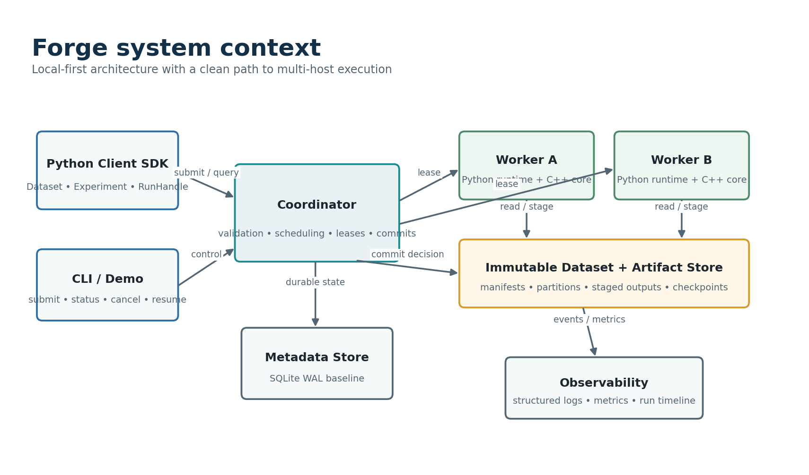
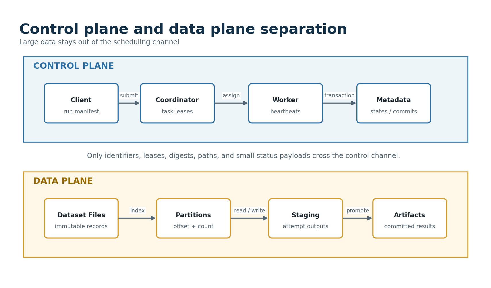

# Part III - System Architecture and Component Boundaries

## 35. Architectural Priorities

- Correctness and inspectability outrank peak throughput in the first implementation.
- A single coordinator is the only authority for task state and result commitment; workers are replaceable executors.
- Large immutable data moves through files, memory maps, or explicit shared buffers rather than through the control-message channel.
- The metadata store contains durable coordination truth; the artifact store contains immutable bytes; neither substitutes for the other.
- Processes are preferred over threads at the worker boundary because they make crashes, resource accounting, and Python interpreter isolation observable.
- The implementation keeps a single-process reference path alive throughout the project so optimization does not erase the oracle.
- All queues are bounded, and overload is represented as waiting, rejection, or backpressure rather than hidden memory growth.
- Optional complexity must be replaceable behind an interface. A Unix-domain socket may become TCP; a file path may become an object key; the task semantics remain stable.

## 36. System Context

{width="5.366666666666666in" height="3.157230971128609in"}

The client submits a canonical run manifest through the Python SDK or CLI. The coordinator validates it, writes durable run and task records, and exposes work to registered workers. Workers pull one task at a time, read immutable dataset partitions, execute a registered Python or C++ kernel, and write attempt-scoped staged output. The coordinator validates that output and commits one winner. Observability is fed by all components but does not determine correctness.

The baseline is local-first: all processes run on one Linux host and share a filesystem. This creates enough realism to demonstrate process boundaries, sockets, leases, crashes, durable state, and backpressure without requiring cloud infrastructure. A later multi-host mode is an adapter and deployment exercise, not a rewrite of semantics.

## 37. Deployment Modes

**Table 20 --- Supported and experimental deployment modes.**

  --------------------------------------------------------------------------------------------------------------------------------------------------------------------------------------------------------------------
  Mode                       Processes and transport                                        Storage assumption                               Purpose                                                      Gate
  -------------------------- -------------------------------------------------------------- ------------------------------------------------ ------------------------------------------------------------ ------------
  Reference                  One Python process; direct function calls                      Local immutable files                            Oracle, debugging, semantic tests, baseline performance      MVP

  Embedded local             Coordinator plus multiprocessing children; internal queues     Local filesystem                                 First durable scheduler and crash tests                      Gate A

  Socket local               Coordinator and independent workers over Unix-domain sockets   Local filesystem                                 Real framing, lifecycle, partial I/O, independent restarts   Gate B

  Loopback TCP               Independent processes over TCP on one host                     Local filesystem                                 Protocol parity and network-stack measurement                Gate B

  Trusted multi-host         Coordinator and workers over private TCP                       Shared filesystem or explicit artifact adapter   Optional distribution and network-failure study              P2

  Shared-memory experiment   Local processes plus bounded shared batch buffers              Local filesystem                                 Measure copy/serialization tradeoff                          Research
  --------------------------------------------------------------------------------------------------------------------------------------------------------------------------------------------------------------------

Every mode must use the same accepted run manifest, partition plan, task identifiers, kernel registry, result schema, and canonical digest. Deployment changes may affect timing and attempt history, not logical output.

## 38. Component Inventory

**Table 21 --- Recommended component inventory.**

  ----------------------------------------------------------------------------------------------------------------------------------------------------------
  Module or component   Responsibility                                                                     Boundary
  --------------------- ---------------------------------------------------------------------------------- -------------------------------------------------
  forge.api             Public Python models and user-facing client objects                                Run manifests, IDs, immutable status views

  forge.cli             Command-line interface and scripted demonstration                                  Text/JSON output; no hidden business logic

  forge.domain          Enums, value objects, state transitions, validation, invariants                    No sockets, database handles, or filesystem I/O

  forge.planner         Dataset validation and deterministic partition/task planning                       Pure or explicitly parameterized

  forge.coordinator     Submission, worker registry, scheduling, leases, commits, cancellation, recovery   Single logical leader

  forge.metadata        Transactional persistence interface and SQLite implementation                      Durable coordination truth

  forge.artifacts       Immutable artifact writer, verifier, publisher, and cleanup policy                 Bytes and digests; no scheduling decisions

  forge.protocol        Message models, framing, encoder/decoder, version negotiation                      Transport-independent payload semantics

  forge.transport       In-process, Unix-domain, and TCP session implementations                           Backpressure and lifecycle

  forge.worker          Worker process, task runtime, kernel dispatch, staging, telemetry                  No durable commit authority

  forge.kernels         Python kernel registry and reference implementations                               Trusted, versioned computations

  forge_cpp             C++20 parsing and aggregation extension                                            Narrow batch API through pybind11

  forge.datasets        Synthetic generator, manifest tools, readers, partition index                      Immutable inputs

  forge.observability   Logging context, metrics, traces, diagnostic bundle                                Never authoritative for state

  forge.bench           Workload manifests, runner, raw record schema, analysis                            Separate from production-like execution path

  forge.testing         Fakes, deterministic clock, fault injector, model oracles                          Test-only control surfaces
  ----------------------------------------------------------------------------------------------------------------------------------------------------------

## 39. Control Plane and Data Plane

{width="5.366666666666666in" height="3.157230971128609in"}

Control messages contain identities, versions, lease tokens, paths or object keys, digests, progress counters, and small error summaries. They do not contain million-record partitions or large result payloads. Workers read dataset files directly and stage results in the artifact store. This keeps the coordinator responsive, makes protocol limits defensible, and allows data-path experiments without rewriting scheduling semantics.

The rule is not absolute. Very small reference results or status payloads may travel inline when bounded by the protocol. Any inline payload needs a strict maximum and a benchmark that justifies the exception.

## 40. Dependency Direction

    forge.api / forge.cli
              |
              v
    forge.coordinator -----> forge.metadata
          |   |             forge.artifacts
          |   +-----------> forge.protocol / forge.transport
          v
    forge.domain <---------- forge.worker
          ^                       |
          |                       v
    forge.planner           forge.kernels / forge_cpp
          |
          v
    forge.datasets

- Domain types and state transitions must not import the coordinator, database, transport, or CLI.
- The coordinator depends on metadata and artifact interfaces, not concrete SQLite paths or directory layouts.
- Workers depend on protocol and kernel interfaces but do not import coordinator internals.
- Benchmark and test packages may depend on public interfaces and controlled test hooks; core packages must not import benchmark code.
- C++ bindings expose domain-neutral batches and result structures. They should not open the metadata database or decide leases.
- Circular imports are a design signal. Resolve them by moving shared value types downward rather than using runtime import tricks.

## 41. Pure Core and Impure Edges

Keep the hardest semantic decisions in pure or deterministic functions whenever possible. Examples include transition validation, retry classification, partition planning, merge ordering, canonicalization, and scheduling eligibility. Keep time, sockets, processes, files, and SQL behind explicit adapters.

**Table 22 --- Pure-core and impure-edge separation.**

  ----------------------------------------------------------------------------------------------
  Pure or deterministic core                      Impure edge
  ----------------------------------------------- ----------------------------------------------
  validate_run_manifest(manifest, registries)     Read manifest bytes and resolve artifact URI

  plan_partitions(dataset, policy)                Inspect file metadata or checksum files

  next_task_state(state, event)                   Persist transition transaction

  eligible_tasks(snapshot, worker_capabilities)   Receive worker request over socket

  retry_decision(error, attempts, policy)         Schedule timer and send assignment

  canonical_result_digest(result)                 Write staged artifact and fsync

  recovery_actions(metadata_snapshot, now)        Open SQLite and inspect filesystem
  ----------------------------------------------------------------------------------------------

## 42. Process and Threading Model

The recommended coordinator is one Python process with one asyncio event loop. Database operations are short and serialized through a narrow repository layer; expensive checksum or filesystem work is delegated to a bounded executor. Each worker is an independent Python process. A worker executes one task at a time in the baseline, which makes capacity, cancellation, and peak memory easy to explain. Later, a worker may supervise one child task process so a hung kernel can be terminated without killing the control session.

The C++ extension may use internal threads only after the external worker model is stable and benchmarks demonstrate benefit. Nested process and thread parallelism can oversubscribe CPUs and make scaling results misleading, so the default C++ kernel should remain single-threaded.

**Table 23 --- Recommended concurrency and ownership model.**

  ------------------------------------------------------------------------------------------------------------------------------------------------------------------------------------------------------------------
  Actor                    Concurrency model                                     Owned mutable state                                                  Blocking policy
  ------------------------ ----------------------------------------------------- -------------------------------------------------------------------- --------------------------------------------------------------
  Coordinator              Single asyncio loop                                   In-memory indexes, session registry, timer heap, scheduling queues   Never block on long compute or large file operations.

  Metadata repository      Serialized calls or one dedicated thread/connection   Database transaction state                                           Transactions are short; no network waits inside transaction.

  Artifact verifier        Bounded thread/process executor                       Temporary checksum buffers                                           May block on disk; returns result to event loop.

  Worker control process   Async or simple event loop                            Session, lease, task-process handle                                  Must remain responsive to heartbeat and cancel.

  Task process             One kernel invocation                                 Partition-local data and output writer                               May block on input and output by design.

  C++ kernel               Single thread initially                               Batch-local parser and accumulator state                             No coordinator callbacks; releases GIL around long compute.
  ------------------------------------------------------------------------------------------------------------------------------------------------------------------------------------------------------------------

## 43. End-to-End Command and Data Flow

1.  The client canonicalizes an experiment request, supplies a client request ID, and submits it.
2.  The coordinator validates schema, dataset manifest, kernel identity, parameters, partition policy, and resource limits.
3.  Within a transaction, the coordinator creates the run, partition plan, tasks, and immutable accepted manifest reference.
4.  An eligible worker registers or heartbeats, advertises available capacity, and sends a work request.
5.  The scheduler selects a pending task, creates a new attempt and lease generation, commits the lease, and sends the assignment.
6.  The worker verifies the assignment, acknowledges start, opens the immutable partition, and executes the registered kernel.
7.  The task process writes an attempt-scoped result, closes it, calculates a digest, and returns a descriptor to the worker control process.
8.  The worker reports staged completion with attempt, task, lease generation, artifact descriptor, metrics, and result schema.
9.  The coordinator verifies state and artifact integrity, then conditionally commits one attempt and records the result reference.
10. After every required map task commits, the coordinator creates or runs the deterministic merge stage.
11. The final result is normalized, hashed, committed, and compared against optional reference evidence.
12. The coordinator marks the run successful and exposes a result handle, manifests, metrics, and diagnostic references.

## 44. Bounded Queues and Backpressure

Every producer-consumer boundary needs a capacity, saturation metric, wait policy, and shutdown behavior. An unbounded asyncio queue is not harmless merely because messages are small; a stuck consumer can still exhaust memory and hide overload.

**Table 24 --- Queue boundaries and backpressure behavior.**

  ------------------------------------------------------------------------------------------------------------------------------------------------------------------------------------------------
  Boundary                      Recommended bound                                        Saturation behavior                                             Metric
  ----------------------------- -------------------------------------------------------- --------------------------------------------------------------- -----------------------------------------
  Incoming frames per session   Bytes and decoded-message count                          Pause socket reads or close abusive session                     session_input_bytes, decode_queue_depth

  Work requests                 At most one outstanding request per worker slot          Reject duplicate or coalesce                                    pending_work_requests

  Scheduler ready tasks         Durable tasks may be many; in-memory window is bounded   Page from metadata as capacity opens                            ready_window_depth

  Artifact verifications        Small executor queue                                     Delay commit response and apply session backpressure            artifact_verify_queue

  Worker input batches          One or a few batches per task                            Reader blocks or awaits free slot                               input_batch_queue_depth

  Worker result batches         Bounded by writer capacity                               Kernel or producer waits                                        result_queue_depth

  Log events                    Bounded with severity-aware policy                       Block critical events; sample or count low-value debug events   log_dropped_total

  Benchmark samples             Fixed-size buffers or streaming file writer              Flush periodically; never retain all raw events in memory       bench_buffer_depth
  ------------------------------------------------------------------------------------------------------------------------------------------------------------------------------------------------

## 45. Ownership Map

**Table 25 --- Resource ownership and authority.**

  --------------------------------------------------------------------------------------------------------------------------------------------
  Resource                       Authoritative owner                Other access
  ------------------------------ ---------------------------------- --------------------------------------------------------------------------
  Run and task state             Coordinator metadata transaction   Workers receive immutable snapshots and propose events.

  Lease generation               Coordinator                        Worker echoes token but cannot create or extend authority unilaterally.

  Dataset bytes                  Artifact/dataset store             Workers read immutable ranges.

  Attempt staging path           One worker attempt                 Coordinator verifies; cleanup service may remove after terminal state.

  Committed artifact reference   Coordinator metadata commit        Clients and merge stage read immutable object.

  Worker child process           Worker control process             Coordinator may request cancellation but does not signal child directly.

  Protocol session               Transport adapter                  Coordinator receives typed events; domain layer never owns socket.

  Metrics instruments            Component-local instrumentation    Exporter reads aggregate values; correctness never depends on them.

  Benchmark raw file             Benchmark runner                   Analysis scripts read only after close.
  --------------------------------------------------------------------------------------------------------------------------------------------

## 46. Error Taxonomy Across Boundaries

- **User errors** are returned with stable codes and field context. They do not produce retries or stack traces by default.
- **Protocol errors** terminate or quarantine a session and include a bounded reason. Raw hostile payloads are not copied into logs.
- **Worker task errors** are normalized into retryable or terminal classes with exception type, bounded message, and optional fingerprint.
- **Storage errors** identify operation, path or object key, expected digest, and whether state may have changed.
- **Internal invariant errors** trigger fail-closed behavior and a diagnostic bundle; they are never converted to an ordinary retry silently.
- **Cancellation** is not logged as an error unless shutdown policy fails or a worker ignores cancellation beyond grace.
- **Benchmark invalidation** is distinct from runtime failure. Thermal throttling, background load, or missing environment metadata can invalidate a sample without implying a product bug.

## 47. Configuration Model

Configuration should be explicit, typed, validated once, and printed in normalized form. Precedence should be deterministic: package defaults, configuration file, environment overrides for secrets or deployment-specific values, and command-line overrides. The accepted run manifest captures semantic execution settings; process configuration captures operational settings.

**Table 26 --- Configuration groups and validation.**

  ----------------------------------------------------------------------------------------------------------------------------------------------------------------------
  Group                Examples                                                               Validation
  -------------------- ---------------------------------------------------------------------- --------------------------------------------------------------------------
  Coordinator          bind address, max sessions, scheduler window, shutdown grace           Ports/paths valid; bounds positive; local-only default.

  Metadata             SQLite path, busy timeout, synchronous mode, migration policy          Directory writable; supported durability mode.

  Artifacts            root path, staging TTL, checksum algorithm, fsync policy               Root isolated; no traversal; same-filesystem rename assumption declared.

  Leases               duration, heartbeat interval, start timeout, max attempts, backoff     Heartbeat \< lease; ranges coherent; zero/negative rejected.

  Worker               capacity, child start method, memory limit, cache size, task timeout   Capacity bounded; platform capabilities checked.

  Protocol             max frame bytes, max outstanding requests, handshake timeout           Hard maximum compiled or centrally enforced.

  Benchmark            warmups, repetitions, affinity, workload manifest, sample output       No accidental debug build; output directory empty or versioned.
  ----------------------------------------------------------------------------------------------------------------------------------------------------------------------

## 48. Architecture Decision Records

Record decisions whose alternatives affect semantics, failure behavior, ownership, or measurement. An ADR is short: context, decision, alternatives, consequences, evidence, and revisit trigger.

**Table 27 --- Initial ADR backlog.**

  -------------------------------------------------------------------------------------------------------------------------------------------------------------
  ADR                  Decision to record                                              Revisit trigger
  -------------------- --------------------------------------------------------------- ------------------------------------------------------------------------
  ADR-001              At-least-once task execution with exactly-once visible commit   Kernel side effects become a requirement.

  ADR-002              Single coordinator and SQLite WAL for the baseline              Measured coordinator or availability requirement exceeds design.

  ADR-003              Immutable files for dataset and artifact data plane             Data-copy or shared-storage results justify another adapter.

  ADR-004              Pull-based worker scheduling                                    Fairness, latency, or locality study shows a concrete limitation.

  ADR-005              Registered kernels instead of arbitrary pickled callables       A safe distribution and compatibility scheme is designed.

  ADR-006              One task per worker at Gate A                                   Resource profiles and measurements justify concurrency.

  ADR-007              Batch-oriented pybind11 API                                     Call overhead is negligible and a finer API improves usability.

  ADR-008              Metadata transaction is commit authority                        Alternative transactional artifact store is proven.

  ADR-009              Contiguous record partitions                                    Skew or format requirements justify indexed or key-based partitioning.

  ADR-010              No web UI before operational CLI completeness                   CLI evidence is complete and UI adds a distinct signal.
  -------------------------------------------------------------------------------------------------------------------------------------------------------------

## 49. Architecture Review Questions

- Which component is allowed to say a task is committed, and where is that fact durable?
- What happens if a worker finishes after its lease expires?
- Which bytes travel through the coordinator, and what prevents an oversized payload?
- Can the coordinator restart while workers continue? What messages are accepted after reconnection?
- Can two attempts write the same path or overwrite committed data?
- Which operations occur inside a database transaction, and can any of them block on a worker or large file?
- How does a run remain deterministic when tasks finish in a different order?
- What memory usage is bounded by configuration, and what happens at the bound?
- Which interfaces make the reference path structurally independent from the optimized path?
- What is the smallest demonstrable release if the optional transport or C++ work takes longer than expected?
