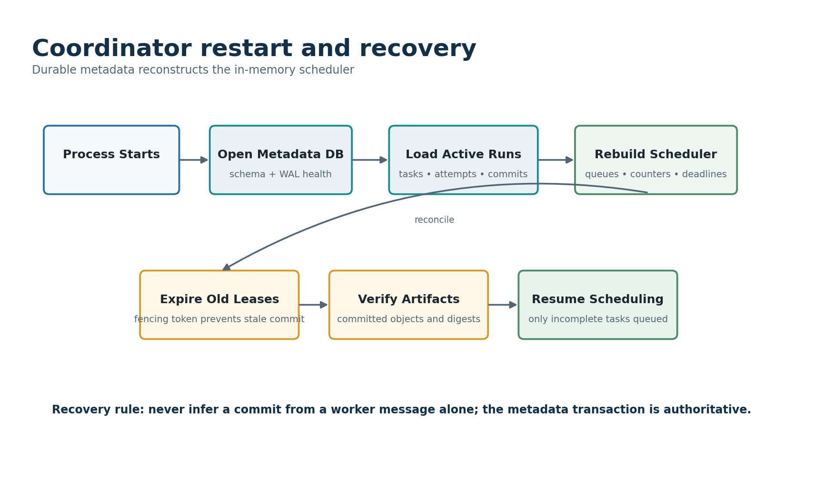

# Part IV - Coordinator Design and Durable Scheduling

## 50. Coordinator Responsibilities and Prohibitions

**Table 28 --- Coordinator responsibilities and prohibitions.**

  ------------------------------------------------------------------------------------------------------------------------
  Coordinator must                                        Coordinator must not
  ------------------------------------------------------- ----------------------------------------------------------------
  Validate submissions and create durable runs/tasks      Execute large data kernels in the event-loop thread

  Maintain worker sessions and eligibility                Treat a heartbeat as proof that a task output is valid

  Create leases and fencing generations transactionally   Trust worker-provided paths outside artifact policy

  Classify failures and schedule bounded retries          Retry deterministic errors forever

  Verify staged results and commit one winner             Publish an artifact based only on a message

  Recover scheduling state from durable metadata          Require in-memory queues to reconstruct correctness

  Expose status, logs, metrics, and diagnostics           Use observability stores as authoritative state

  Stop safely on invariant failure                        Attempt undocumented automatic repair of inconsistent metadata
  ------------------------------------------------------------------------------------------------------------------------

## 51. Recommended Coordinator Package Layout

    forge/coordinator/
      app.py              # startup, shutdown, dependency wiring
      service.py          # submission, status, cancel use cases
      scheduler.py        # eligibility and task selection
      leases.py           # issue, renew, expire, fence
      workers.py          # registry and session lifecycle
      commits.py          # staging validation and conditional commit
      recovery.py         # restart reconciliation
      timers.py           # monotonic deadlines and deterministic test clock
      events.py           # typed internal coordinator events
      models.py           # immutable coordinator views
      api.py              # transport-facing request handlers
      diagnostics.py      # invariant scan and bundle generation

Files should remain small enough that state transitions can be reviewed in context. Avoid a single Coordinator class containing sockets, SQL, timers, scheduler policy, artifact operations, and CLI rendering.

## 52. Coordinator Startup and Shutdown Lifecycle

Startup is a recovery operation, not merely dependency construction. The coordinator must establish that metadata, artifacts, schemas, configuration, and exclusive leadership are coherent before accepting clients or workers.

### Design contract

- Acquire a process or database leadership lock appropriate to the single-coordinator design.
- Validate configuration and directory ownership before opening network listeners.
- Open metadata, apply only tested migrations, and verify the expected application schema version.
- Reconcile active runs and leases before advertising readiness.
- Expose separate liveness and readiness signals; a process can be alive while still recovering.
- On shutdown, stop admission first, mark workers draining, persist final events, and close listeners before releasing leadership.

### Implementation sequence

1.  Build a dependency container containing clock, ID generator, metadata repository, artifact store, scheduler policy, metrics, and logger.
2.  Run migrations in a transaction or refuse startup if an unsupported migration path is detected.
3.  Load active run summaries and rebuild bounded in-memory indexes rather than reading every historical row.
4.  Expire or conservatively reconcile old leases using restart policy and fencing generations.
5.  Start timer, session, and scheduling loops only after recovery completes.
6.  Implement graceful shutdown with a configurable drain/cancel policy and a hard deadline.

### Verification evidence

- Starting a second coordinator against the same metadata store fails clearly.
- Startup after a clean stop preserves all states and schedules no completed task.
- Startup after forced termination reconciles active leases according to policy.
- Readiness remains false while migrations or recovery are incomplete.
- Shutdown during active work leaves metadata restartable and does not commit partial output.

### Failure modes and review questions

- A migration partially applies or a filesystem is mounted read-only.
- The leadership lock is stale after a crash or cannot distinguish two hosts.
- Shutdown waits on a worker that never responds.
- Recovery performs unbounded work before readiness; define paging and progress.
- A signal arrives during startup before all dependencies exist.

## 53. Submission, Validation, and Idempotent Run Creation

Submission converts an untrusted but bounded client request into an immutable accepted run. Validation should fail before expensive planning or worker activity, and client retries should not create accidental duplicate runs.

### Design contract

- Require a schema version and reject requests over a configured size.
- Accept an optional client_request_id unique within a client namespace.
- Canonicalize and hash the manifest before durable creation.
- Resolve dataset and kernel identities through registries; do not accept arbitrary absolute paths or import strings unchecked.
- Create the run, accepted manifest reference, partitions, and tasks in one transaction or in a restartable planning protocol.
- Return stable error codes and field paths for validation failures.

### Implementation sequence

1.  Parse into typed request models with strict unknown-field policy.
2.  Validate cross-field relationships such as lease policy, partition size, and kernel parameters.
3.  Verify dataset manifest signature or digest and basic file availability according to submission validation mode.
4.  Calculate experiment hash and look up an existing client request before creating a run.
5.  Insert run and plan records transactionally; persist a planning failure rather than losing context after run ID allocation.
6.  Return a RunHandle containing run ID, accepted manifest digest, state, and status endpoint.

### Verification evidence

- The same client_request_id and same canonical request returns the same run.
- The same client_request_id with different content returns a conflict.
- Invalid schemas, unknown kernels, missing datasets, bad parameters, and excessive limits fail before task leasing.
- Process termination during planning leaves either no run or a recoverable PLANNING run, never an invisible half-plan.
- Canonicalization fixtures remain stable across supported Python versions.

### Failure modes and review questions

- Dataset files disappear after validation but before execution.
- A manifest uses path traversal, symlinks, device files, or excessively deep JSON.
- Planning creates millions of tasks and exceeds transaction or memory limits.
- A client times out after the transaction commits and retries.
- Two identical submissions race with the same idempotency key.

## 54. Planning Transaction and Task Materialization

For modest educational workloads, materialize all task rows during planning. This makes status and recovery simple. For very large task counts, a later version may page or lazily materialize tasks, but the optimization should not complicate Gate A.

1.  Load and validate the immutable dataset manifest.
2.  Calculate deterministic partition descriptors and prove complete, non-overlapping coverage.
3.  Create task IDs from run, stage, and partition identity using a stable mapping or generated IDs stored alongside deterministic ordinals.
4.  Insert partitions and tasks in batches inside the run-planning transaction.
5.  Record total logical records, bytes, partition count, planner version, and plan digest.
6.  Transition the run from PLANNING to RUNNING only after all required rows and the accepted manifest are durable.
7.  Emit one run-planned event after commit; observers must not see tasks before the run is runnable.

If planning cannot fit comfortably in one transaction, use a restartable PLANNING state with idempotent batch inserts and a final plan-seal transaction. Do not expose partially planned tasks to workers.

## 55. Worker Registration and Session Registry

The worker registry maps live protocol sessions to durable or semi-durable worker identities and advertised capabilities. Session identity is ephemeral; worker identity and attempt history remain inspectable after disconnect.

### Design contract

- Require protocol negotiation before registration.
- Record worker ID, session ID, software version, kernel capabilities, architecture, capacity, and resource limits.
- Allow one active session per worker identity unless a replacement policy explicitly fences the old session.
- Treat network address and PID as diagnostic attributes, not stable identity.
- A disconnected worker becomes LOST for scheduling but historical attempts remain unchanged until lease policy acts.
- Capability changes require re-registration and cannot mutate an already leased task contract.

### Implementation sequence

1.  Implement a typed WorkerCapabilities model and compatibility predicate.
2.  Persist registration and last-seen summaries if needed for recovery and diagnostics.
3.  Maintain an in-memory session map keyed by session ID and worker ID with bounded cardinality.
4.  On replacement, close or fence the older session and increment a worker session generation.
5.  Expose drain and quarantine controls for tests and maintenance.
6.  Emit registration, replacement, disconnect, and quarantine events with correlation IDs.

### Verification evidence

- Duplicate registration, session replacement, and reconnect sequences are deterministic.
- An incompatible worker cannot receive a task whose kernel or protocol it does not support.
- A disconnected worker does not hold a scheduling slot forever.
- A worker advertising capacity N never receives more than N active leases.
- A quarantined worker cannot request new work until explicitly cleared.

### Failure modes and review questions

- Two processes start with the same configured worker ID.
- A worker lies about a kernel version or architecture.
- A reconnect arrives while the previous TCP connection appears half-open.
- Registration storms fill memory or logs.
- A session sends work requests before registration completes.

## 56. Pull-Based Scheduler Baseline

In the baseline, an idle worker asks for work. The coordinator selects one compatible pending task and creates a lease transactionally. Pull scheduling naturally limits outstanding assignments to worker capacity, handles heterogeneous kernel support, and avoids pushing work to a slow or disconnected worker. It does not eliminate the need for fairness, admission control, or lease timeouts.

    async def request_work(worker: WorkerView) -> Assignment | NoWork:
        if not worker.is_eligible or worker.available_slots <= 0:
            return NoWork(reason='worker_not_eligible')

        candidate = scheduler.choose_task(
            ready_runs=ready_run_window,
            worker=worker,
        )
        if candidate is None:
            return NoWork(reason='no_compatible_task', retry_after_ms=250)

        lease = await metadata.create_lease_if_pending(
            task_id=candidate.task_id,
            worker_id=worker.worker_id,
            duration=lease_policy.duration,
        )
        if lease is None:
            return NoWork(reason='candidate_raced', retry_after_ms=10)
        return assignment_from(lease, candidate)

- Scheduler selection may be pure over a bounded snapshot, but lease creation is a conditional metadata transaction.
- A failed conditional lease due to a race is normal; select again rather than treating it as an invariant failure.
- NoWork responses should include jittered retry guidance so idle workers do not spin or synchronize into a request storm.
- The baseline chooses from a bounded ready window, ordered by run priority, fairness policy, task ordinal, and retry eligibility time.
- A task is compatible only when worker kernel/version, platform, resource profile, and deployment assumptions match.

## 57. Lease Creation Transaction

1.  Select or receive a candidate task that appears PENDING and whose retry_not_before time has passed.
2.  Begin an immediate transaction appropriate to SQLite to serialize the state change.
3.  Re-read task and run state; reject if run is terminal, cancelling, or task is no longer pending.
4.  Increment the task fencing generation and create a unique attempt row.
5.  Create the lease row or task lease fields with worker ID, issued timestamp, wall-clock expiry, and generation.
6.  Transition task to LEASED and increment active counters for the worker and run.
7.  Commit the transaction before sending the assignment.
8.  If sending fails, leave the lease to expire or perform a documented immediate revoke transaction; do not pretend it never existed without evidence.

The assignment response includes all immutable input descriptors needed by the worker plus the lease token. It does not include a mutable Python object whose identity matters to later messages.

## 58. Heartbeat, Start Acknowledgment, and Lease Renewal

Heartbeat processing maintains liveness without allowing message volume to dominate the coordinator. A task-level renewal is distinct from a worker session heartbeat, although one message may carry both.

### Design contract

- Require a start acknowledgment within a fraction of the lease duration or treat the attempt as suspect.
- Renew only current attempt and fencing generation.
- Cap renewal extension and record the last durable renewal at a controlled cadence.
- Progress counters are advisory and monotonic; they do not authorize commit.
- Coalesce or sample high-frequency heartbeats while preserving enough durability for restart policy.
- A worker must receive an explicit stale-lease response when a renewal is rejected.

### Implementation sequence

1.  Use one timer heap or timing wheel for next expiry checks rather than one asyncio task per lease at large scale.
2.  Separate session liveness timestamp from durable lease expiry.
3.  Batch durable heartbeat updates when safe, but never extend an expired or replaced generation.
4.  Emit metrics for renewal latency, rejected renewals, heartbeat jitter, and time-to-expiry.
5.  On event-loop delay, process expiries conservatively and record scheduler lag.
6.  Test with a fake monotonic clock and deterministic event ordering.

### Verification evidence

- Renewal with wrong worker, attempt, task, or generation is rejected.
- Delayed duplicate heartbeat does not move state backward.
- Coordinator pause longer than the lease produces documented behavior rather than mass silent commit.
- Session heartbeat without task renewal does not preserve a task lease accidentally.
- High heartbeat volume remains bounded and does not starve submission or commit handling.

### Failure modes and review questions

- Database stalls cause renewal writes to miss deadlines.
- The event loop is blocked by checksum work.
- A worker clock is wrong; coordinator time must remain authoritative.
- A heartbeat arrives after cancellation or commit.
- The coordinator restarts and monotonic deadlines are not transferable.

## 59. Lease Expiry and Retry Scheduling

Expiry processing should be idempotent. The coordinator may observe the same expired lease in several scans or receive a late disconnect event. One conditional transition records the attempt as LOST or EXPIRED, clears active capacity, and either requeues the task with a retry-not-before timestamp or fails it according to policy.

- Do not delete expired attempt history; it is essential for debugging and resume claims about failure recovery.
- Use bounded exponential backoff with deterministic jitter derived from task and attempt identity for repeatable tests.
- Reset backoff or classify terminal errors only through explicit policy.
- When many workers vanish together, throttle retries to avoid a thundering herd.
- A staged artifact from an expired attempt is quarantined or may be considered under a separately documented late-result policy; the conservative baseline discards it as a commit candidate.

## 60. Conditional Result Commit

The commit path is the most important correctness boundary in the coordinator. Keep it small, transactional, and exhaustively tested.

    verify message shape and schema
      -> verify task/attempt/worker relationship
      -> verify artifact path policy and existence
      -> verify size and digest outside DB transaction
      -> begin transaction
         -> reload run, task, attempt, lease generation
         -> reject cancelled/terminal/stale/conflicting state
         -> insert or confirm artifact record
         -> mark attempt COMMITTED
         -> mark task COMMITTED with winner and digest
         -> update run committed counters
         -> append state-transition event
      -> commit transaction
      -> publish response and schedule losing-artifact cleanup

- Large checksum work happens before the metadata transaction, but the transaction must revalidate state because cancellation or another attempt may win while verification runs.
- Artifact verification result includes exact path/key, size, digest algorithm, digest, schema, and verification timestamp.
- The database has a unique constraint enforcing one committed result per task.
- A duplicate identical finish message for the winning attempt returns the existing commit result idempotently.
- A second different digest for the same attempt is an invariant violation and quarantines the worker or run.
- A losing valid attempt receives a duplicate-loser response and its staged artifact enters cleanup policy.

## 61. Run Completion and Deterministic Merge

The baseline merge can run inside a dedicated worker task or a coordinator-supervised local process. It must not block the coordinator event loop. Treat merge as a first-class stage with its own task, attempt, output, digest, and commit where practical; this reuses failure semantics and makes restart behavior consistent.

1.  A transaction observes that every required map task is committed and transitions the run from RUNNING to MERGING exactly once.
2.  Create a merge task referencing committed partition results in canonical ordinal order or a manifest containing those references.
3.  Execute the registered merge kernel with the same staging and conditional commit rules.
4.  Validate final result schema and canonical digest.
5.  Optionally compare against a reference result or independently computed summary for demo workloads.
6.  In one transaction, record final artifact and digest and transition the run to SUCCEEDED.
7.  Emit completion event and expose immutable result handle.

## 62. Cancellation and Administrative Controls

- cancel_run(run_id, reason, requested_by) is idempotent and records the request durably.
- The cancellation transaction moves RUNNING or MERGING to CANCELLING and prevents new leases and commits.
- Active sessions receive cancel-attempt messages after the transaction commits.
- Workers have a cooperative grace period followed by child-process termination. The lease remains evidence even if the child dies.
- When no active attempts remain, incomplete tasks become CANCELLED and the run becomes CANCELLED.
- Administrative retry or resume should create a new run from the old manifest unless the semantics of mutating terminal history are carefully designed.
- Quarantine, drain, and diagnostic operations are authenticated or local-only and are recorded as administrative events.

## 63. Metadata Repository Interface

    class MetadataRepository(Protocol):
        async def create_run(self, plan: AcceptedRunPlan) -> RunRecord: ...
        async def get_run(self, run_id: RunId) -> RunSnapshot: ...
        async def list_ready_tasks(self, query: ReadyTaskQuery) -> list[TaskView]: ...
        async def create_lease_if_pending(
            self, request: LeaseRequest
        ) -> LeaseRecord | None: ...
        async def renew_lease(self, request: RenewalRequest) -> RenewalResult: ...
        async def expire_due_leases(self, now: datetime) -> list[RetryAction]: ...
        async def commit_staged_result(
            self, request: CommitRequest
        ) -> CommitResult: ...
        async def request_cancellation(self, run_id: RunId, reason: str) -> RunRecord: ...
        async def recovery_snapshot(self) -> RecoverySnapshot: ...
        async def assert_consistent(self, scope: ConsistencyScope) -> ConsistencyReport: ...

Do not make the interface a generic CRUD wrapper. Each method should express a semantic transaction and return a typed outcome such as committed, stale, cancelled, raced, or invariant failure.

## 64. SQLite Transaction and Connection Policy

- Use WAL mode for concurrent readers and one disciplined writer path; document the exact PRAGMA settings used.
- Use foreign keys, unique indexes, CHECK constraints, and NOT NULL constraints to enforce cheap invariants.
- Keep transactions short and never await network I/O or hash a large file while a write transaction is open.
- Use BEGIN IMMEDIATE or another intentional locking mode for lease and commit transitions; measure contention rather than guessing.
- Set a bounded busy timeout and surface sustained contention through metrics and errors.
- Store timestamps in a canonical UTC representation and retain generation counters for authority.
- Back up or copy the database only through a supported snapshot mechanism; copying live database files casually can produce inconsistent evidence.
- Treat synchronous mode as a named durability choice in benchmarks. Do not compare throughput across modes without labeling them.

## 65. Coordinator Restart and Recovery

{width="5.366666666666666in" height="3.157230971128609in"}

1.  Acquire single-leader ownership and open metadata in validated schema mode.
2.  Load active runs, nonterminal tasks, current attempts, leases, and committed artifact references in pages.
3.  Verify database invariants before making scheduling decisions.
4.  Translate persisted lease expiry and restart policy into conservative actions. Old workers cannot retain authority without reconnecting and presenting matching generation.
5.  Verify committed artifacts at the configured recovery integrity level. Missing committed data is a failure, not a task silently returned to pending.
6.  Inspect staged artifacts referenced by attempts and classify them as current, stale, orphaned, or corrupt.
7.  Rebuild ready-task windows, run counters, worker capacity state, and timer deadlines from authoritative rows.
8.  Resume listeners and mark readiness only after reconciliation completes.
9.  Record a recovery report containing counts, actions, duration, and any degraded condition.

The simplest safe policy after coordinator restart is to treat all previously active worker sessions as disconnected and allow leases to expire or explicitly revoke them with new fencing generations. Workers reconnect and request new work. More aggressive lease preservation is optional and requires a clear session-resumption protocol.

## 66. Recovery Reconciliation Matrix

**Table 29 --- Coordinator recovery decisions.**

  ---------------------------------------------------------------------------------------------------------------------------------------------------------------------------------------------------------------
  Metadata state                                            Artifact observation                                                Recovery action
  --------------------------------------------------------- ------------------------------------------------------------------- ---------------------------------------------------------------------------------
  Task COMMITTED                                            Committed artifact exists and digest matches                        Keep terminal state; count toward run completion.

  Task COMMITTED                                            Artifact missing or digest differs                                  Fail affected run or enter CORRUPT diagnostic state; never re-execute silently.

  Attempt STAGED, task not committed                        Staged artifact valid; lease current policy unknown after restart   Conservative baseline marks attempt stale and schedules cleanup/retry.

  Attempt RUNNING, lease expired                            No staged artifact                                                  Mark attempt LOST; retry or fail according to budget.

  Attempt RUNNING, lease not expired by wall-clock policy   Worker session absent                                               Wait brief reconnect grace or expire conservatively; document choice.

  Task PENDING                                              Orphan staging file exists                                          Do not commit; quarantine or clean after TTL.

  Run MERGING                                               Merge task committed but run not SUCCEEDED                          Verify final artifact and idempotently finish transition.

  Run CANCELLING                                            Active attempts absent                                              Finalize incomplete tasks and run as CANCELLED.

  Metadata references unknown schema                        Any                                                                 Refuse readiness and require migration or manual inspection.
  ---------------------------------------------------------------------------------------------------------------------------------------------------------------------------------------------------------------

## 67. Coordinator APIs

**Table 30 --- Coordinator service operations.**

  -----------------------------------------------------------------------------------------------------------------------------------------------------------------------------------------------------
  Operation         Request essentials                                  Response essentials                                      Idempotency
  ----------------- --------------------------------------------------- -------------------------------------------------------- ----------------------------------------------------------------------
  submit_run        schema, manifest, client_request_id                 run_id, accepted_digest, state                           Same key + same request returns same run.

  get_run           run_id, optional detail level                       immutable status snapshot and links                      Naturally idempotent.

  list_runs         filters, cursor, limit                              paged summaries                                          Cursor-stable within documented ordering.

  cancel_run        run_id, reason, request_id                          new/current state                                        Repeated cancellation returns current result.

  register_worker   identity, session, capabilities, version            accepted capabilities and heartbeat policy               Session generation resolves repeats.

  request_work      worker/session, available slot                      assignment or bounded no-work response                   One outstanding request per slot.

  ack_start         attempt, lease generation                           accepted or stale                                        Duplicate identical acknowledgment accepted.

  heartbeat         session and active lease renewals                   renewed/stale per lease                                  Duplicates do not extend incorrectly.

  stage_result      attempt, generation, artifact descriptor, metrics   commit, duplicate, stale, cancelled, or verify-pending   Same attempt + digest returns same outcome.

  report_failure    attempt, generation, normalized error               retry/terminal/stale decision                            Duplicate failure is stable.

  drain_worker      worker and reason                                   draining state                                           Repeated request is stable.

  diagnose          scope and output path                               bundle reference and consistency report                  Creates a new diagnostic artifact but does not mutate run semantics.
  -----------------------------------------------------------------------------------------------------------------------------------------------------------------------------------------------------

## 68. Coordinator Observability

- Counters: submissions, accepted runs, rejected runs, leases issued, renewals, expiries, retries, commits, duplicate losers, cancellations, invariant failures.
- Gauges: active sessions, idle workers, active leases, ready tasks in window, verification queue depth, database writer queue, runs by state.
- Histograms: submission validation, lease transaction, heartbeat processing, artifact verification, commit transaction, scheduler decision, recovery duration.
- Structured events: every state transition with before, after, cause, actor, correlation ID, and durable event sequence where available.
- Lag signals: event-loop lag, lease-expiry processing lag, database busy time, artifact verification backlog, metrics exporter delay.
- Cardinality policy: never use run ID, task ID, or attempt ID as unrestricted metric labels; keep them in logs and traces.

## 69. Coordinator Performance Considerations

Do not optimize the coordinator before measuring. Likely pressure points include SQLite write serialization, heartbeat volume, repeated ready-task queries, checksum verification, JSON encoding, and high-cardinality logs. The correct response may be batching or reducing work, not rewriting the coordinator in C++.

- Cache immutable run and kernel summaries, but validate mutable task state in transactions.
- Maintain a bounded ready window rather than loading every pending task into Python objects.
- Batch event inserts or heartbeat persistence only when the durability consequence is documented.
- Move large file hashing to a bounded executor and instrument queue delay separately from hash time.
- Use prepared SQL and explicit indexes; inspect query plans for ready-task, active-lease, and run-status queries.
- Profile object allocation and serialization before introducing custom binary internal structures.
- Measure coordinator CPU and maximum sustainable task-completion rate with no-op kernels to isolate scheduler overhead.

## 70. Coordinator Acceptance Test Matrix

**Table 31 --- Coordinator acceptance tests.**

  --------------------------------------------------------------------------------------------------------------
  Test ID                        Acceptance case
  ------------------------------ -------------------------------------------------------------------------------
  COORD-001                      Valid submission creates one durable run and complete plan.

  COORD-002                      Invalid submission creates no runnable tasks and returns stable field errors.

  COORD-003                      Same idempotency key and request returns the same run under concurrency.

  COORD-004                      Two workers racing for one task create one active lease.

  COORD-005                      Wrong worker or stale fencing generation cannot renew.

  COORD-006                      Expired lease creates one retry attempt despite repeated scans.

  COORD-007                      Two staged attempts race; one commits and the other is a loser.

  COORD-008                      Cancellation before commit prevents later stage result from becoming visible.

  COORD-009                      Coordinator restart does not reassign committed tasks.

  COORD-010                      Missing committed artifact fails recovery visibly.

  COORD-011                      Event-loop lag and database contention metrics are emitted under stress.

  COORD-012                      Graceful shutdown stops admission and leaves restartable state.

  COORD-013                      Forced termination at each transaction boundary recovers to a valid state.

  COORD-014                      Ready-task window remains bounded for a large plan.

  COORD-015                      Invariant scanner finds intentionally corrupted fixture rows.
  --------------------------------------------------------------------------------------------------------------
