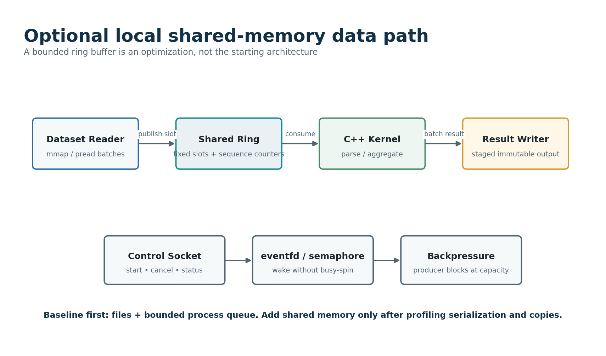

# Part VII - Protocol, Transport, Flow Control, and Shared Memory

## 103. Protocol Design Goals

- Versioned and self-bounded before payload allocation.
- Incrementally decodable across arbitrary socket fragmentation and coalescing.
- Independent of Unix-domain or TCP transport.
- Small control payloads with explicit maximum frame and field lengths.
- Idempotency and correlation fields present where retries are possible.
- Stable error codes and state outcomes rather than parsing human strings.
- Inspectable with a protocol dump tool and reproducible binary fixtures.
- No unsafe native object deserialization and no implicit code loading.

## 104. Frame Header

**Table 44 --- Suggested 40-byte control frame header.**

  ------------------------------------------------------------------------------------------------------------------
  Offset          Bytes           Field              Purpose
  --------------- --------------- ------------------ ---------------------------------------------------------------
  0               4               magic = FGR1       Rapid desynchronization detection.

  4               1               major_version      Incompatible semantics boundary.

  5               1               minor_version      Negotiated compatible additions.

  6               2               message_type       Registry key.

  8               2               flags              Compression, response, error, reserved.

  10              2               header_bytes       Allows future header extension.

  12              4               payload_bytes      Validated against hard maximum before allocation.

  16              8               correlation_id     Matches request and response; zero for selected events.

  24              8               session_sequence   Detects duplicate, gap, or replay according to message class.

  32              4               payload_crc32c     Optional accidental corruption detection.

  36              4               reserved           Must be zero for v1.
  ------------------------------------------------------------------------------------------------------------------

Encode multibyte values in network byte order or a documented fixed endianness. Validate magic, header length, version, flags, payload length, and sequence policy before allocating a payload buffer. CRC is optional on local trusted transports and must be benchmarked if enabled.

## 105. Message Registry

**Table 45 --- Control protocol message registry.**

  ----------------------------------------------------------------------------------------------------------
  Type            Message            Direction              Payload purpose
  --------------- ------------------ ---------------------- ------------------------------------------------
  1               HELLO              Both                   Version range, limits, implementation identity

  2               HELLO_ACK          Both                   Selected version and limits

  10              REGISTER_WORKER    Worker → coordinator   Identity and capabilities

  11              REGISTERED         Coordinator → worker   Session generation and heartbeat policy

  12              WORKER_HEARTBEAT   Worker → coordinator   Session liveness and capacity

  20              REQUEST_WORK       Worker → coordinator   Available slot and supported profile

  21              ASSIGN_TASK        Coordinator → worker   Task launch specification and lease

  22              NO_WORK            Coordinator → worker   Reason and retry delay

  23              ACK_START          Worker → coordinator   Attempt and generation

  24              LEASE_RENEW        Worker → coordinator   Attempt progress and renewal request

  25              LEASE_STATUS       Coordinator → worker   Renewed, stale, cancelled, or unknown

  30              STAGE_RESULT       Worker → coordinator   Artifact descriptor and task metrics

  31              COMMIT_RESULT      Coordinator → worker   Winner, duplicate loser, stale, or cancelled

  32              REPORT_FAILURE     Worker → coordinator   Normalized error and metrics

  33              FAILURE_DECISION   Coordinator → worker   Retry, terminal, stale, or cancelled

  40              CANCEL_ATTEMPT     Coordinator → worker   Reason and grace deadline

  41              DRAIN_WORKER       Coordinator → worker   No-new-work policy

  50              QUERY_ATTEMPT      Worker → coordinator   Reconnect reconciliation

  51              ATTEMPT_STATUS     Coordinator → worker   Durable task/attempt outcome

  60              PING/PONG          Both                   Transport liveness only

  255             ERROR              Both                   Bounded stable error response
  ----------------------------------------------------------------------------------------------------------

## 106. Payload Encoding Choice

Use a schema-aware, bounded payload encoding. A pragmatic educational baseline is canonical JSON for early fixtures and debugging, followed by MessagePack or a small hand-encoded binary schema if profiling shows JSON cost matters. Protocol semantics must not depend on Python pickle.

**Table 46 --- Control payload encoding alternatives.**

  ------------------------------------------------------------------------------------------------------------------------------------------------------------------------------------------------
  Option                   Strengths                                      Weaknesses                                                        Recommended use
  ------------------------ ---------------------------------------------- ----------------------------------------------------------------- ------------------------------------------------------
  Canonical JSON           Human-readable, easy fixtures, broad tooling   Larger and slower; integer and byte handling need care            MVP and reference protocol.

  MessagePack              Compact, simple cross-language support         Schema discipline remains application responsibility              Gate B control payload candidate.

  Protocol Buffers         Strong schema and compatibility tooling        Generated code and dependency add scope                           Optional comparison, not required.

  Custom binary payloads   Maximum control and learning                   Highest bug and maintenance risk                                  Only for a few hot fixed messages after measurement.

  pickle                   Easy Python object transfer                    Unsafe for untrusted input, Python-specific, poor compatibility   Explicitly prohibited.
  ------------------------------------------------------------------------------------------------------------------------------------------------------------------------------------------------

## 107. Incremental Decoder State Machine

    NEED_FIXED_HEADER
      read until 40 bytes available
      validate magic, version, header_bytes, payload_bytes, flags
         |
         v
    NEED_EXTENDED_HEADER (only if header_bytes > 40)
         |
         v
    NEED_PAYLOAD
      read exactly payload_bytes
      validate optional CRC
         |
         v
    DECODE_TYPED_MESSAGE
      parse bounded fields and schema
      emit message
      reset to NEED_FIXED_HEADER

- Never assume one recv returns one frame.
- Support several frames in one read and one frame split across many reads.
- Place a hard cap on total buffered bytes per session.
- On malformed length or unsupported required feature, close the session after a bounded error if safe.
- Do not scan arbitrarily for the next magic value after hostile input unless a resynchronization policy is explicitly bounded.
- Fuzz the decoder with random fragments, concatenations, truncations, and mutated lengths.

## 108. Encoder and Output Queue

- Calculate and validate payload length before allocating the final frame.
- Use immutable bytes or a small vector of buffers until the frame is fully written.
- A send call may write only part of a frame; retain offset and resume on writable readiness.
- Bound queued output bytes per session. When the bound is reached, stop producing optional messages, apply upstream backpressure, or close a nonresponsive peer according to policy.
- Responses preserve request correlation ID. Session sequence numbers increase monotonically for messages that require ordering.
- Do not interleave bytes from two frames accidentally when several coroutine producers share a session; use one serialized writer loop.

## 109. Unix-Domain Socket Transport

- Use filesystem or abstract namespace according to documented Linux support; protect filesystem socket permissions.
- Remove a stale socket path only after proving no active listener owns it.
- Set close-on-exec and nonblocking flags intentionally.
- Capture peer credentials where supported for local diagnostic or authorization policy, but do not rely on them across TCP.
- Use the same framing, handshake, limits, and message handlers as TCP.
- Benchmark UDS against loopback TCP only after semantic parity and with the same payload encoding.

## 110. TCP Transport

- Bind to loopback by default. Multi-host binding requires explicit configuration and threat-model acknowledgment.
- Use TCP keepalive only as a coarse dead-peer signal; application heartbeats and leases remain authoritative.
- Set socket options based on measurement. Do not enable TCP_NODELAY reflexively without a small-message latency study.
- Resolve addresses at startup and log the actual bound endpoint.
- Handle half-close, reset, timeout, and abrupt process death distinctly where useful.
- TLS and authentication are optional extensions for a trusted-network study; plain TCP must not be presented as Internet-safe.

## 111. Asyncio Session Architecture

    class WorkerSession:
        async def run(self) -> None:
            async with self._lifecycle():
                async with asyncio.TaskGroup() as group:
                    group.create_task(self._reader_loop())
                    group.create_task(self._writer_loop())
                    group.create_task(self._heartbeat_watchdog())

        async def send(self, message: Message) -> None:
            frame = self._encoder.encode(message)
            await self._bounded_outgoing.put(frame)

- One reader parses frames and dispatches typed messages through bounded handlers.
- One writer owns byte ordering and partial-write state.
- TaskGroup or equivalent structured concurrency ensures one fatal loop failure closes the session and cancels siblings.
- Message handlers avoid long work; artifact verification and database calls are awaited through bounded services.
- A per-session cancellation scope prevents leaked tasks after disconnect.
- Every created task has an owner and shutdown path; avoid fire-and-forget create_task without tracking.

## 112. Session Sequencing and Idempotency

Sequence numbers detect accidental duplicate or reordering within a session, but reconnect creates a new session sequence space. Semantic idempotency relies on run/task/attempt identifiers and request IDs, not on a TCP connection surviving.

- HELLO begins at a defined sequence and negotiates whether strict contiguous sequencing is required.
- Duplicate request with the same correlation and semantic identity may return a cached or reconstructed response.
- A sequence gap is a protocol error for messages that must be ordered; optional telemetry may use a looser policy only if explicit.
- Reconnect reconciliation uses QUERY_ATTEMPT and durable identifiers rather than replaying an arbitrary old session buffer.
- Bound response caches by count and time; durable outcomes can be re-read from metadata instead of cached forever.

## 113. Heartbeat and Timeout Separation

**Table 47 --- Distinct timing mechanisms.**

  -------------------------------------------------------------------------------------------------------------
  Timer                       Purpose                                        Authority
  --------------------------- ---------------------------------------------- ----------------------------------
  Transport idle timeout      Detect a silent or stuck socket session        Session lifecycle only.

  Worker heartbeat interval   Advertise liveness and available capacity      Coordinator session registry.

  Task lease expiry           End temporary execution authority              Durable task semantics.

  Task timeout                Limit kernel wall time                         Worker runtime and run policy.

  Cancellation grace          Allow cooperative cleanup before termination   Worker supervisor.

  No-work retry delay         Avoid idle request spin                        Coordinator scheduling response.
  -------------------------------------------------------------------------------------------------------------

## 114. Protocol Backpressure State Machine

- NORMAL: reads and writes enabled; queue depths below soft limits.
- READ_PAUSED: outgoing or handler backlog high; stop reading more frames while socket buffer applies pressure.
- TELEMETRY_REDUCED: drop or coalesce optional progress events while preserving lease and terminal messages.
- DRAINING: no new assignments; finish required responses and close cleanly.
- CLOSING: protocol error, timeout, or hard bound exceeded; cancel handlers, flush bounded error if safe, close socket.
- Record transitions and time spent in each state. Persistent READ_PAUSED indicates downstream saturation, not a network mystery.

## 115. Optional Shared-Memory Data Path

{width="5.366666666666666in" height="3.157230971128609in"}

Shared memory is a research extension after the file and bounded-queue baseline is measured. The likely target is repeated copying or Python serialization of batches between a reader process and C++ consumer. A fixed-slot ring with per-slot sequence counters, explicit ownership, and eventfd/semaphore wakeups is easier to reason about than a variable-length lock-free structure.

Shared memory does not replace the control protocol, durable artifacts, leases, or commits. It is only a local data-plane adapter. A producer that reaches capacity must wait; overwriting unread slots is a correctness failure.

**Table 48 --- Shared-memory ring contract.**

  ---------------------------------------------------------------------------------------------------------------------
  Ring element                   Required state
  ------------------------------ --------------------------------------------------------------------------------------
  Header                         magic, version, slot count, slot bytes, producer/consumer generations

  Slot metadata                  sequence number, payload length, record count, checksum, state

  Producer rule                  Writes only a free expected sequence, publishes metadata last with release ordering

  Consumer rule                  Reads only a published expected sequence, validates length/checksum, frees after use

  Wakeup                         eventfd/semaphore/condition to avoid unbounded busy-spin

  Shutdown                       Explicit closed flag and generation; blocked peer wakes and exits

  Crash recovery                 Baseline discards ring and retries task; no durable state in shared memory
  ---------------------------------------------------------------------------------------------------------------------

## 116. Protocol Defensive Limits

- Maximum frame bytes, extended-header bytes, string bytes, collection count, nesting depth, and decoded object size.
- Maximum sessions, outstanding work requests, output bytes per session, and in-flight message handlers.
- Strict UTF-8 or explicit byte fields; reject invalid encoding rather than normalizing silently.
- Unknown enum values rejected unless a forward-compatible optional field policy applies.
- No path use before root confinement and normalization.
- No exception traceback or arbitrary payload echo in an ERROR response.
- Handshake timeout and pre-registration message whitelist.
- Rate limits or immediate close for repeated malformed frames.

## 117. Protocol Test Matrix

**Table 49 --- Protocol and transport tests.**

  -------------------------------------------------------------------------------------------------------
  Test ID                        Acceptance case
  ------------------------------ ------------------------------------------------------------------------
  PROTO-001                      One frame split at every possible byte boundary decodes once.

  PROTO-002                      Many frames in one read decode in order.

  PROTO-003                      Bad magic, version, header size, flags, and reserved bits reject.

  PROTO-004                      Payload length over maximum rejects before allocation.

  PROTO-005                      Truncated peer close produces a protocol error without hang.

  PROTO-006                      Partial writes preserve exact byte order across frames.

  PROTO-007                      Output queue bound pauses or closes according to policy.

  PROTO-008                      Duplicate semantic request returns an idempotent result.

  PROTO-009                      Sequence gap and replay follow negotiated policy.

  PROTO-010                      Reconnect can query durable attempt outcome.

  PROTO-011                      UDS and TCP produce identical typed message traces.

  PROTO-012                      Decoder fuzz corpus runs under sanitizers where C++ is involved.

  PROTO-013                      Malformed nested payload respects depth and count limits.

  PROTO-014                      Slow reader cannot cause unbounded coordinator output memory.

  PROTO-015                      Shared-memory ring blocks at capacity and detects generation mismatch.
  -------------------------------------------------------------------------------------------------------
