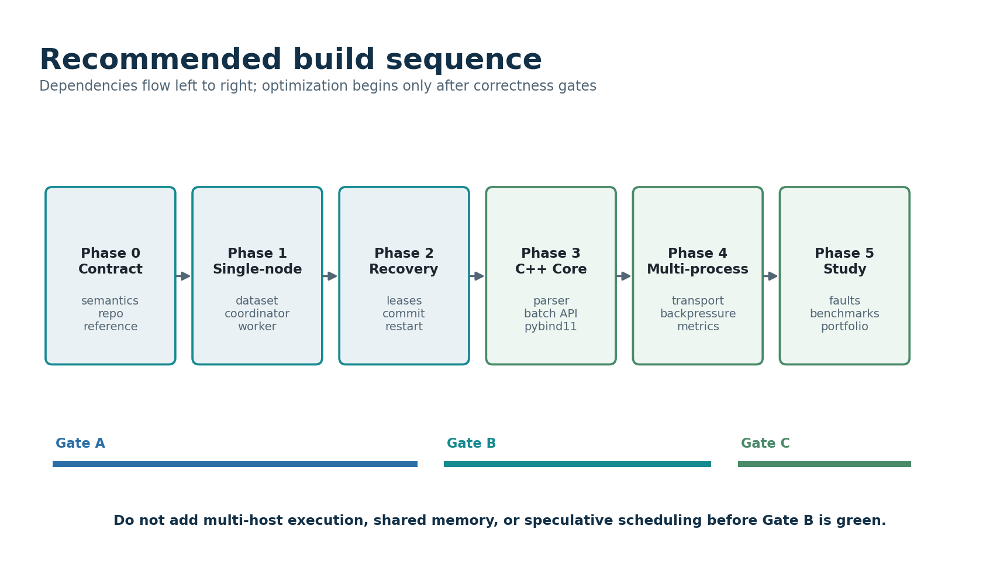

# Part XVII - Twenty-Week Execution Roadmap, Epics, Backlog, and Risk Control

## 266. Roadmap Purpose and Planning Assumptions

The roadmap converts the architecture into a sequence of independently demonstrable systems. It assumes one student engineer working approximately fifteen to twenty focused hours per week while taking classes and preparing for interviews. The schedule is deliberately conservative: each milestone reserves time for tests, documentation, debugging, and evidence capture rather than treating those activities as work that happens after implementation.

The schedule is not a promise to implement every optional feature. The critical path ends with a durable local coordinator, process-isolated workers, deterministic data and result contracts, a framed local protocol, one measured C++ accelerator, automated failure injection, and a reproducible benchmark report. Shared memory, multi-host execution, speculative execution, compression, and advanced scheduling are research extensions. They should be attempted only when the core release gates are green and the benchmark evidence identifies a concrete reason.

{width="5.483333333333333in" height="3.2258672353455817in"}

## 267. Planning Constraints

**Table 87 --- Roadmap planning constraints.**

  ----------------------------------------------------------------------------------------------------------------------------------------------------------------------------------------
  Constraint                  Planning rule                                                                               Reason
  --------------------------- ------------------------------------------------------------------------------------------- ----------------------------------------------------------------
  Single developer            No milestone may require parallel feature teams or simultaneous architectural migrations.   The plan must remain executable by one person.

  Academic workload           Each week has a must-have outcome and a clearly labeled stretch outcome.                    A missed stretch item must not invalidate the milestone.

  Correctness before speed    Performance work begins only after deterministic reference and recovery tests exist.        Otherwise optimization defects have no reliable oracle.

  Evidence as a deliverable   Every gate produces commands, logs, fixtures, diagrams, and a tagged commit.                The portfolio claim must remain reproducible later.

  Scope control               Optional distributed features need a measured bottleneck or explicit learning hypothesis.   Novelty alone is not sufficient justification.

  Public safety               Only generated or redistributable datasets enter the repository.                            The project must be easy to clone and legally safe to publish.

  Resource limits             The default demo must run on a typical laptop with bounded disk and memory.                 Reviewers should not need cloud infrastructure.

  Interview readiness         Every milestone includes an explanation exercise and design questions.                      Building and communicating are separate skills.
  ----------------------------------------------------------------------------------------------------------------------------------------------------------------------------------------

## 268. Milestone Gates

**Table 88 --- Milestone gates and demonstrations.**

  ---------------------------------------------------------------------------------------------------------------------------------------------------------------------------------------------------------------------------------------------------------------------------------------------------------------
  Gate                                       Target          Required state                                                                                                                                 Acceptance demonstration
  ------------------------------------------ --------------- ---------------------------------------------------------------------------------------------------------------------------------------------- -----------------------------------------------------------------------------------------------------
  Gate 0 --- Contract frozen                 Week 2          Vocabulary, invariants, event format, kernel contract, result model, repository skeleton, and architecture decisions reviewed.                 A new contributor can explain the execution model without reading implementation code.

  Gate A --- Deterministic reference         Week 4          Single-process engine produces reproducible outputs, manifests, checksums, and differential test fixtures.                                     Two identical runs normalize to the same manifest and output digest.

  Gate B --- Durable local execution         Week 8          Coordinator, SQLite state, worker processes, leases, retries, staged artifacts, conditional commit, cancellation, and restart recovery.        Script kills a worker and restarts the coordinator without ambiguous visible results.

  Gate C --- Protocol-connected runtime      Week 11         Framed UDS protocol, incremental decoder, bounded write queues, version negotiation, heartbeat and capability messages.                        Coordinator and independently launched workers complete a run and reject malformed traffic safely.

  Gate D --- Measured native acceleration    Week 14         C++20 parser/aggregator, pybind11 batches, sanitizer coverage, correctness comparison, and crossover benchmark.                                Evidence identifies where native execution helps and where boundary overhead dominates.

  Gate E --- Failure and performance study   Week 17         Automated crash matrix, scheduler/load experiments, scaling study, raw evidence schema, profiling reports, and negative results.               A clean command regenerates the principal tables and charts from raw evidence.

  Gate F --- Portfolio release               Week 20         Public documentation, demo, tagged source, reproducible evidence bundle, limitations, technical presentation, and truthful resume claim map.   A reviewer can clone, build, run, break, recover, and evaluate Forge from the release instructions.
  ---------------------------------------------------------------------------------------------------------------------------------------------------------------------------------------------------------------------------------------------------------------------------------------------------------------

## 269. Critical Path

1.  Freeze semantics and identifiers before building the database schema. A schema created around vague task semantics becomes expensive to repair.
2.  Build the deterministic single-process reference before multiprocessing. It becomes the oracle for generated tests and native comparisons.
3.  Persist coordinator state before adding retries. Retry logic without durable ownership and attempt identity creates ambiguous commits.
4.  Implement attempt-scoped staging and conditional publication before coordinator restart. Recovery is only meaningful when stale work cannot overwrite committed state.
5.  Make worker lifecycle deterministic before networking. Debugging process, protocol, and storage failures simultaneously obscures root causes.
6.  Stabilize the protocol before optimizing transport. Incremental decoding, limits, versioning, and backpressure matter more than message encoding novelty.
7.  Measure the Python implementation before choosing the C++ boundary. Native code should accelerate an observed hot path, not merely add a language logo.
8.  Automate failures before conducting final performance studies. A fast system that cannot survive the documented failure cases has not met the product thesis.
9.  Freeze workloads, environment manifests, and raw evidence formats before publishing claims.
10. Release the repository only after a clean-machine rehearsal and a claim-by-claim evidence audit.

## 270. Recommended Weekly Operating Rhythm

**Table 89 --- Weekly engineering rhythm.**

  ---------------------------------------------------------------------------------------------------------------------------------------------------------------------------------------------------
  Moment                  Activity                                                                                                         Artifact
  ----------------------- ---------------------------------------------------------------------------------------------------------------- ----------------------------------------------------------
  Start of week           Select one must-have outcome, one stretch outcome, and the failure case that could invalidate them.              Weekly plan issue with explicit acceptance commands.

  Before coding           Write or update a failing test, state transition, schema migration, protocol fixture, or benchmark hypothesis.   Red test or frozen evidence manifest.

  During implementation   Commit small vertical changes, preserve logs, and write decisions while context is fresh.                        Reviewable commits and ADR notes.

  Midweek                 Run the smallest end-to-end demonstration and inspect durable state and artifacts manually.                      Captured run directory and diagnostic bundle.

  End of week             Run gate checks, update risk register, record defects and surprises, and explain the design aloud.               Weekly engineering note and updated milestone dashboard.

  Monthly                 Perform a clean-clone build, dependency audit, and evidence reproducibility rehearsal.                           Clean environment report.
  ---------------------------------------------------------------------------------------------------------------------------------------------------------------------------------------------------

## 271. Week 1 --- Problem Contract, Repository, and Development Environment

Turn the project idea into a falsifiable contract. Establish a repository that can build Python and C++ placeholders, run tests, enforce formatting, and document decisions before implementing distributed behavior.

### Must-have outcomes

- Create the repository layout, license, contribution rules, issue templates, branch protection expectations, and initial README thesis.
- Pin supported Python and compiler versions; establish pyproject.toml, CMake presets, virtual-environment instructions, and pre-commit checks.
- Write the glossary for dataset, run, task, attempt, lease, worker, artifact, checkpoint, and commit.
- Write ADR-0001 for local-first deployment and ADR-0002 for at-least-once execution with exactly-once visible result publication.
- Create a one-command smoke test that imports the Python package, builds a trivial native extension, and runs one unit test in each language.

### Stretch outcomes

- Create a development container and verify that host and container builds produce the same small test output.
- Add a documentation site skeleton and automated link checking.

### End-of-week acceptance demonstration

Clone into a clean directory, run the documented setup command, execute Python and C++ tests, and explain every term in the execution vocabulary.

### Evidence to preserve

Build transcript, toolchain manifest, repository tree, ADRs, and a screenshot or terminal recording of the clean setup.

### Weekly review questions

- Which execution contract or invariant became clearer or changed this week?
- What is the smallest command that proves the must-have outcome?
- Which failure did the implementation handle explicitly, and which one remains undefined?
- What did measurement or testing contradict?
- Could a reviewer reproduce the result from committed files without personal context?

## 272. Week 2 --- Execution Semantics, State Machines, and Immutable Schemas

Freeze the contracts that later concurrency and recovery code must preserve. Define identifiers, transitions, idempotency keys, checksums, and validation limits before database or network implementation.

### Must-have outcomes

- Define JSON schemas or typed models for dataset manifests, experiment manifests, run manifests, partition descriptors, kernel descriptors, and artifact descriptors.
- Write transition tables for run, task, attempt, lease, worker, and cancellation state.
- Define the 32-byte synthetic event record, file header, endianness, version, record count, and checksum behavior.
- State all cross-component invariants and map each invariant to at least one planned test.
- Create canonical example manifests and invalid fixtures covering unknown fields, bad versions, duplicate identifiers, path traversal, and checksum mismatch.

### Stretch outcomes

- Generate schema documentation from typed models.
- Write a small state-machine model that explores legal and illegal transitions without executing real work.

### End-of-week acceptance demonstration

Validate good fixtures, reject bad fixtures with stable error codes, and walk through a task from pending to committed and through lease expiry to retry.

### Evidence to preserve

Schema files, state diagrams, invariant matrix, invalid corpus, and Gate 0 review checklist.

### Weekly review questions

- Which execution contract or invariant became clearer or changed this week?
- What is the smallest command that proves the must-have outcome?
- Which failure did the implementation handle explicitly, and which one remains undefined?
- What did measurement or testing contradict?
- Could a reviewer reproduce the result from committed files without personal context?

## 273. Week 3 --- Deterministic Dataset Generator and Reference Reader

Build a reproducible source of immutable data and a deliberately simple reader whose behavior can serve as the correctness oracle for later optimized paths.

### Must-have outcomes

- Implement a seeded synthetic event generator with fixed distributions and explicit generator-version metadata.
- Write binary file headers and fixed-width event records using checked arithmetic and atomic publication.
- Implement a Python reader that validates magic, version, lengths, record count, checksum, and event fields.
- Partition datasets deterministically by record range and produce partition descriptors with byte offsets and digests.
- Add golden-file, truncation, corruption, boundary, and round-trip tests.

### Stretch outcomes

- Implement memory-mapped and buffered reference readers behind the same iterator contract.
- Add a dataset inspection CLI with sample, validate, and summarize commands.

### End-of-week acceptance demonstration

Generate a dataset twice from the same manifest, compare digests, inspect records, corrupt one byte, and show a precise validation failure.

### Evidence to preserve

Generator manifest, golden dataset, checksum report, partition map, and corruption-test transcript.

### Weekly review questions

- Which execution contract or invariant became clearer or changed this week?
- What is the smallest command that proves the must-have outcome?
- Which failure did the implementation handle explicitly, and which one remains undefined?
- What did measurement or testing contradict?
- Could a reviewer reproduce the result from committed files without personal context?

## 274. Week 4 --- Single-Process Experiment Engine and Reference Kernels

Complete Gate A with an understandable baseline that executes registered kernels, merges deterministic partial results, and records enough provenance to reproduce the run.

### Must-have outcomes

- Create a kernel registry with stable kernel identifiers, versions, parameter validation, and declared result schemas.
- Implement at least three reference kernels: event counts, keyed aggregation, and rolling statistics or checksum reduction.
- Execute partitions sequentially, write attempt-like local outputs, merge in canonical partition order, and publish a result manifest.
- Normalize run metadata so nondeterministic timestamps or paths do not affect the semantic result digest.
- Add replay, deterministic-output, invalid-parameter, merge-order, and differential tests.

### Stretch outcomes

- Add a streaming kernel interface and explicitly document why arbitrary mutable kernel state is excluded.
- Create a tiny HTML or Markdown run report generated from the manifest.

### End-of-week acceptance demonstration

Run the same experiment twice, compare normalized output bytes and digests, then compare a generated workload against a slow independent implementation.

### Evidence to preserve

Gate A tag, run manifests, normalized digest comparison, reference-kernel tests, and architecture note describing the oracle role.

### Weekly review questions

- Which execution contract or invariant became clearer or changed this week?
- What is the smallest command that proves the must-have outcome?
- Which failure did the implementation handle explicitly, and which one remains undefined?
- What did measurement or testing contradict?
- Could a reviewer reproduce the result from committed files without personal context?

## 275. Week 5 --- Durable Metadata Store and Coordinator Domain Layer

Introduce persistence without workers. The coordinator should be able to create runs, plan tasks, apply legal transitions transactionally, and recover its domain state from SQLite.

### Must-have outcomes

- Implement schema migrations for datasets, experiments, runs, tasks, attempts, leases, workers, artifacts, and event journal records.
- Enable SQLite foreign keys, WAL mode, busy timeout, explicit transactions, and integrity checks.
- Create typed repository interfaces and domain services that do not leak raw SQL into scheduler logic.
- Implement idempotent run submission keyed by request identity and deterministic task planning.
- Add transaction rollback, uniqueness, restart, migration, and concurrent-reader tests.

### Stretch outcomes

- Add an append-only coordinator event journal for diagnosis while keeping normalized tables authoritative.
- Create a metadata inspection CLI with read-only queries.

### End-of-week acceptance demonstration

Submit the same run request twice, prove only one run is created, restart the coordinator object, and list the same planned tasks from durable state.

### Evidence to preserve

ER diagram, migration files, integrity-check output, transaction tests, and database snapshot.

### Weekly review questions

- Which execution contract or invariant became clearer or changed this week?
- What is the smallest command that proves the must-have outcome?
- Which failure did the implementation handle explicitly, and which one remains undefined?
- What did measurement or testing contradict?
- Could a reviewer reproduce the result from committed files without personal context?

## 276. Week 6 --- Local Worker Runtime and Process Supervision

Run trusted kernels in child processes with explicit lifecycle, cancellation, timeout, and result staging. The coordinator may still communicate through an in-process adapter.

### Must-have outcomes

- Implement worker registration, capability declaration, work polling, and a bounded local execution queue.
- Use spawn-compatible multiprocessing and isolate each attempt in a supervised child process.
- Define signal escalation: cooperative cancellation, graceful terminate, timeout, and forced kill.
- Create attempt-specific directories and write outputs to temporary files with fsync and descriptor generation.
- Capture stdout/stderr safely with byte limits and structured attempt logs.

### Stretch outcomes

- Apply portable resource limits where available and document platform differences.
- Add a warm-worker mode as an experiment while preserving a process-per-attempt correctness baseline.

### End-of-week acceptance demonstration

Run several partitions in parallel, cancel one attempt, force one timeout, and inspect bounded logs and staged artifacts.

### Evidence to preserve

Process tree capture, lifecycle state log, timeout test, staging directory sample, and worker contract documentation.

### Weekly review questions

- Which execution contract or invariant became clearer or changed this week?
- What is the smallest command that proves the must-have outcome?
- Which failure did the implementation handle explicitly, and which one remains undefined?
- What did measurement or testing contradict?
- Could a reviewer reproduce the result from committed files without personal context?

## 277. Week 7 --- Leases, Retries, Fencing, and Conditional Commit

Implement the central distributed-systems guarantee: attempts may duplicate, but only the currently authorized attempt can make one result visible for a task.

### Must-have outcomes

- Issue monotonic lease epochs or fencing tokens inside the task-assignment transaction.
- Persist heartbeat deadlines and reclaim expired leases through an idempotent sweeper.
- Create a commit transaction that validates task state, attempt identity, lease epoch, output descriptor, and uniqueness before publication.
- Quarantine or garbage-collect losing attempt artifacts without deleting a committed artifact.
- Test both commit race orders, stale heartbeat orderings, duplicate completion messages, and retry exhaustion.

### Stretch outcomes

- Model the commit protocol in a small exhaustive state explorer.
- Add deterministic delay hooks around every commit step for concurrency tests.

### End-of-week acceptance demonstration

Launch two attempts for the same task, let the stale attempt finish last, and show that it cannot replace the committed result.

### Evidence to preserve

Commit sequence diagram, transaction trace, race tests, invariant report, and stale-attempt artifact disposition.

### Weekly review questions

- Which execution contract or invariant became clearer or changed this week?
- What is the smallest command that proves the must-have outcome?
- Which failure did the implementation handle explicitly, and which one remains undefined?
- What did measurement or testing contradict?
- Could a reviewer reproduce the result from committed files without personal context?

## 278. Week 8 --- Coordinator Restart, Cancellation, and Gate B

Make durable local execution survivable across coordinator restart and operator cancellation. Finish the first complete system that embodies the project thesis.

### Must-have outcomes

- Classify in-flight attempts on startup, expire uncertain leases conservatively, and schedule eligible retries.
- Reconcile staged, committed, orphaned, and missing artifact metadata without silently inventing success.
- Implement run cancellation that stops new assignments, requests worker cancellation, and reaches a terminal state after active attempts settle.
- Create startup integrity checks and explicit operator errors for unrecoverable metadata corruption.
- Build a Gate B scenario script covering worker death, duplicate execution, coordinator restart, cancellation, and final merge.

### Stretch outcomes

- Add a checkpoint or snapshot optimization for long-running coordinator metadata replay.
- Create a human-readable recovery report at startup.

### End-of-week acceptance demonstration

Start a run, kill a worker, restart the coordinator during retry, cancel another run, and show unambiguous terminal states and outputs.

### Evidence to preserve

Gate B tag, scripted transcript, database before/after snapshots, diagnostic bundle, and recovery limitations.

### Weekly review questions

- Which execution contract or invariant became clearer or changed this week?
- What is the smallest command that proves the must-have outcome?
- Which failure did the implementation handle explicitly, and which one remains undefined?
- What did measurement or testing contradict?
- Could a reviewer reproduce the result from committed files without personal context?

## 279. Week 9 --- Framed Protocol and Incremental Decoder

Replace in-process control calls with a transport-independent framed protocol that is bounded, versioned, incrementally decoded, and hostile to malformed input.

### Must-have outcomes

- Implement fixed-size frame headers with magic, version, message type, flags, request identifier, payload length, and checksum or validation policy.
- Define message schemas for hello, register, poll, assignment, heartbeat, complete, fail, cancel, status, error, and shutdown.
- Build an incremental decoder that handles fragmentation, coalescing, partial headers, partial payloads, and maximum frame limits.
- Create bounded per-connection output queues and a clear close policy for slow or invalid peers.
- Add golden wire fixtures, protocol compatibility tests, randomized chunking tests, and fuzz entry points.

### Stretch outcomes

- Generate message documentation from schema definitions.
- Implement a protocol capture and decode CLI for debugging.

### End-of-week acceptance demonstration

Feed every possible split of a sample frame, reject an oversized frame before allocating its payload, and decode a captured worker session.

### Evidence to preserve

Protocol specification, wire fixtures, decoder property test, fuzz corpus, and bounds table.

### Weekly review questions

- Which execution contract or invariant became clearer or changed this week?
- What is the smallest command that proves the must-have outcome?
- Which failure did the implementation handle explicitly, and which one remains undefined?
- What did measurement or testing contradict?
- Could a reviewer reproduce the result from committed files without personal context?

## 280. Week 10 --- Async Unix-Domain Socket Server and Worker Client

Connect independently launched coordinator and workers over local sockets while preserving durable semantics and bounded resource behavior.

### Must-have outcomes

- Implement an asyncio coordinator server with one connection state object per worker and explicit read/write tasks.
- Implement reconnecting worker clients with version negotiation, worker identity, capability registration, and jittered backoff.
- Correlate requests and responses, enforce deadlines, and make duplicate messages idempotent where the semantic contract permits.
- Bound unread input, queued output, concurrent requests, and connection counts.
- Add integration tests for disconnects, partial writes, slow readers, reconnects, duplicate registration, and server shutdown.

### Stretch outcomes

- Add TCP as a configuration-equivalent transport and compare local latency without making performance claims.
- Implement peer credential checks for Unix-domain sockets where the platform supports them.

### End-of-week acceptance demonstration

Launch the coordinator and workers as separate processes, complete a run, disconnect a worker mid-message, reconnect it, and finish safely.

### Evidence to preserve

Network trace, connection metrics, integration-test log, resource-bound test, and operations commands.

### Weekly review questions

- Which execution contract or invariant became clearer or changed this week?
- What is the smallest command that proves the must-have outcome?
- Which failure did the implementation handle explicitly, and which one remains undefined?
- What did measurement or testing contradict?
- Could a reviewer reproduce the result from committed files without personal context?

## 281. Week 11 --- Protocol Hardening, Status API, and Gate C

Stabilize the connected runtime before introducing C++. Improve diagnostics, compatibility, backpressure behavior, and operator visibility.

### Must-have outcomes

- Implement stable protocol error codes, version rejection, unknown-message behavior, and capability negotiation.
- Add run, task, worker, lease, and queue-depth status views through CLI or a minimal read-only API.
- Implement graceful coordinator drain and worker shutdown without abandoning committed or staged state.
- Run sustained slow-consumer and malformed-message tests while tracking memory and file descriptors.
- Complete Gate C clean-clone and failure demonstrations.

### Stretch outcomes

- Add authenticated TCP for a loopback multi-process experiment, clearly marked as non-production.
- Create an interactive textual dashboard without making it a release dependency.

### End-of-week acceptance demonstration

Complete a connected run, inspect live status, drain safely, and show that a malformed peer cannot cause unbounded memory growth.

### Evidence to preserve

Gate C tag, compatibility matrix, status screenshots, soak metrics, and protocol threat review.

### Weekly review questions

- Which execution contract or invariant became clearer or changed this week?
- What is the smallest command that proves the must-have outcome?
- Which failure did the implementation handle explicitly, and which one remains undefined?
- What did measurement or testing contradict?
- Could a reviewer reproduce the result from committed files without personal context?

## 282. Week 12 --- Profile the Python Baseline and Select the Native Boundary

Use measured CPU, allocation, and wall-time evidence to choose one narrow C++ acceleration target. Preserve the reference path as the correctness oracle and fallback.

### Must-have outcomes

- Freeze benchmark datasets and kernels for parser and aggregation studies.
- Profile Python reader, decode, kernel, merge, serialization, coordinator, and idle time separately.
- Measure batch-size effects and estimate the Python/C++ call overhead budget.
- Write ADR-000X describing the selected native API, ownership policy, GIL policy, alternatives, and non-goals.
- Create a differential corpus and benchmark harness before implementing the optimized path.

### Stretch outcomes

- Prototype two API shapes to measure boundary overhead before choosing one.
- Record hardware counters for the Python path as contextual evidence.

### End-of-week acceptance demonstration

Present the profile, identify the selected hot path, and explain why other plausible native boundaries were rejected.

### Evidence to preserve

Profile files, benchmark manifest, ADR, differential corpus, and explicit success threshold.

### Weekly review questions

- Which execution contract or invariant became clearer or changed this week?
- What is the smallest command that proves the must-have outcome?
- Which failure did the implementation handle explicitly, and which one remains undefined?
- What did measurement or testing contradict?
- Could a reviewer reproduce the result from committed files without personal context?

## 283. Week 13 --- C++20 Parser and Aggregation Core

Implement the selected native component with strict buffer validation, explicit ownership, checked arithmetic, and the same semantic output as the Python reference.

### Must-have outcomes

- Create typed C++ event views, descriptor types, status or exception policy, and batch aggregation interfaces.
- Accept Python buffer-protocol inputs without retaining unsafe borrowed memory.
- Validate alignment, item size, lengths, versions, ranges, and arithmetic before reading records.
- Release the GIL only while operating on stable memory and reacquire it before Python object construction or exception translation.
- Add GoogleTest cases, pybind11 integration tests, differential tests, ASan, UBSan, debug iterators where supported, and compiler warnings as errors.

### Stretch outcomes

- Add an owning native buffer path and compare it with a borrowed-view path.
- Implement a scalar optimization only after the baseline is correct and profiled.

### End-of-week acceptance demonstration

Run the same corpus through Python and C++, compare canonical outputs, then demonstrate sanitizer-clean malformed-input handling.

### Evidence to preserve

Native API documentation, ownership diagram, sanitizer logs, differential report, and code-review checklist.

### Weekly review questions

- Which execution contract or invariant became clearer or changed this week?
- What is the smallest command that proves the must-have outcome?
- Which failure did the implementation handle explicitly, and which one remains undefined?
- What did measurement or testing contradict?
- Could a reviewer reproduce the result from committed files without personal context?

## 284. Week 14 --- Native Packaging, Crossover Study, and Gate D

Integrate the extension as an optional accelerator, package it cleanly, and quantify when the native path improves end-to-end work rather than only a microkernel.

### Must-have outcomes

- Build source distributions and local wheels or editable installations through a documented pyproject/CMake flow.
- Select native or Python implementation explicitly and record the chosen engine and native version in the run manifest.
- Measure per-call overhead, batch crossover, parser throughput, aggregation throughput, end-to-end throughput, memory, and merge cost.
- Test unsupported platforms or missing extension behavior with clear fallback and diagnostics.
- Write Gate D report including positive, neutral, and negative findings.

### Stretch outcomes

- Build wheels for more than one supported platform through CI.
- Investigate one profile-supported optimization such as reduced copies, better layout, or reserved capacity.

### End-of-week acceptance demonstration

Install from a clean environment, run both engines, compare results, and show the batch size where native execution begins to help.

### Evidence to preserve

Gate D tag, package artifacts, crossover chart source data, manifest comparison, and limitation statement.

### Weekly review questions

- Which execution contract or invariant became clearer or changed this week?
- What is the smallest command that proves the must-have outcome?
- Which failure did the implementation handle explicitly, and which one remains undefined?
- What did measurement or testing contradict?
- Could a reviewer reproduce the result from committed files without personal context?

## 285. Week 15 --- Observability and Automated Failure Injection

Make every important transition diagnosable and every documented crash point executable through a deterministic fault harness.

### Must-have outcomes

- Standardize structured log fields across coordinator, worker, child process, protocol, artifact, and native layers.
- Export metrics for queue depth, assignments, leases, retries, commits, attempt durations, bytes, process exits, and recovery.
- Implement named fault points before and after lease issue, output write, descriptor fsync, commit transaction, publication, and acknowledgement.
- Create a scenario runner that seeds timing, captures process output, preserves artifacts, and asserts final invariants.
- Build a diagnostic bundle command that redacts secrets and gathers manifests, metadata summaries, logs, versions, and relevant files.

### Stretch outcomes

- Add trace correlation or timeline visualization generated from structured events.
- Create a small failure-scenario DSL.

### End-of-week acceptance demonstration

Select fault scenarios by name, run them repeatedly, and produce the same final semantic outcome and a readable timeline.

### Evidence to preserve

Fault catalog, scenario manifests, diagnostic bundle, metrics dictionary, and sample timeline.

### Weekly review questions

- Which execution contract or invariant became clearer or changed this week?
- What is the smallest command that proves the must-have outcome?
- Which failure did the implementation handle explicitly, and which one remains undefined?
- What did measurement or testing contradict?
- Could a reviewer reproduce the result from committed files without personal context?

## 286. Week 16 --- Crash Matrix, Soak Tests, and Recovery Hardening

Exercise combinations of process death, delays, duplicates, corruption, full disks, and restart timing until recovery behavior matches the written contract.

### Must-have outcomes

- Run the complete worker and coordinator crash-point matrix under deterministic seeds.
- Test duplicate completion, stale heartbeat, delayed cancellation, slow reader, partial write, corrupt artifact, missing artifact, and checksum mismatch.
- Run a bounded soak test with repeated runs, retries, cancellations, and cleanup while tracking memory, descriptors, processes, and disk usage.
- Record and fix every invariant violation; convert each discovered defect into a permanent regression test.
- Write at least one detailed postmortem for a nontrivial recovery or race defect.

### Stretch outcomes

- Use a model checker or exhaustive scheduler around a reduced commit/lease state model.
- Run chaos scenarios across two hosts on a private network, clearly separated from the release gate.

### End-of-week acceptance demonstration

Run a selected crash suite and soak summary, then explain the most difficult defect using its timeline and invariant failure.

### Evidence to preserve

Crash matrix, soak report, regression tests, resource graphs, postmortem, and unresolved-risk list.

### Weekly review questions

- Which execution contract or invariant became clearer or changed this week?
- What is the smallest command that proves the must-have outcome?
- Which failure did the implementation handle explicitly, and which one remains undefined?
- What did measurement or testing contradict?
- Could a reviewer reproduce the result from committed files without personal context?

## 287. Week 17 --- Frozen Performance and Scaling Study

Conduct the principal performance study under controlled conditions. Treat reproducibility, uncertainty, and bottleneck explanation as first-class outputs.

### Must-have outcomes

- Record host, CPU, memory, kernel, power policy, toolchain, package versions, source tag, configuration, and dataset digests.
- Measure 1, 2, 4, and 8 workers or the meaningful range for the host, with repeated trials and confidence intervals or robust summaries.
- Separate compute, I/O, scheduler, serialization, commit, merge, and idle time.
- Measure memory, file descriptors, process count, disk bytes, queue depth, retries, and recovery overhead in addition to throughput.
- Preserve raw row-level evidence and generate every table or plot from versioned analysis code.

### Stretch outcomes

- Compare Unix-domain sockets, TCP loopback, and in-process adapters under the same control workload.
- Run the shared-memory transport experiment only when serialization or copying is demonstrated to dominate.

### End-of-week acceptance demonstration

Delete generated charts, regenerate them from raw results, and explain the first scaling bottleneck and one negative experiment.

### Evidence to preserve

Gate E candidate evidence bundle, raw CSV/JSONL, analysis scripts, plots, perf reports, and benchmark narrative.

### Weekly review questions

- Which execution contract or invariant became clearer or changed this week?
- What is the smallest command that proves the must-have outcome?
- Which failure did the implementation handle explicitly, and which one remains undefined?
- What did measurement or testing contradict?
- Could a reviewer reproduce the result from committed files without personal context?

## 288. Week 18 --- Documentation, Examples, and Reviewer Experience

Turn the engineering work into a navigable public argument. Optimize for a reviewer who has ten minutes first and thirty minutes second.

### Must-have outcomes

- Write the README with thesis, quick start, guarantees, architecture, demo, evidence, limitations, and project status near the top.
- Complete semantics, architecture, protocol, storage, testing, benchmark, operations, security, and ADR documentation.
- Create tiny, medium, failure, and benchmark examples with expected outputs and resource estimates.
- Add architecture, commit, recovery, C++ boundary, and evidence-flow diagrams generated from source where practical.
- Run link, command, schema, and example validation in CI.

### Stretch outcomes

- Create a static documentation site and a short captioned demo recording.
- Provide a guided code-reading route for reviewers.

### End-of-week acceptance demonstration

Ask another person to follow the quick start without verbal assistance and record every source of friction.

### Evidence to preserve

Documentation build, usability notes, fixed issues, example outputs, and reviewer route.

### Weekly review questions

- Which execution contract or invariant became clearer or changed this week?
- What is the smallest command that proves the must-have outcome?
- Which failure did the implementation handle explicitly, and which one remains undefined?
- What did measurement or testing contradict?
- Could a reviewer reproduce the result from committed files without personal context?

## 289. Week 19 --- Public Release Rehearsal and Interview Narrative

Rehearse the project as both a software release and an interview artifact. Remove unsupported claims, accidental complexity, secrets, personal paths, and unreproducible assumptions.

### Must-have outcomes

- Clone into a clean environment, build, test, run the demo, run selected failures, and regenerate benchmark summaries from documented commands.
- Audit repository history and release artifacts for secrets, private data, machine-specific paths, oversized files, and licensing issues.
- Create a claim map linking each README and resume statement to a tag, command, evidence file, and limitation.
- Prepare a five-minute overview, twelve-minute demo, thirty-minute technical talk, and deep-dive answers for design tradeoffs.
- Conduct mock interviews on execution guarantees, SQLite concurrency, process supervision, protocol parsing, C++ ownership, and benchmark validity.

### Stretch outcomes

- Ask an external reviewer to file issues based only on the public documentation.
- Create a release candidate and test installation from that artifact rather than the working tree.

### End-of-week acceptance demonstration

Deliver the project overview and demo without notes, then answer adversarial questions using repository evidence rather than unsupported generalities.

### Evidence to preserve

Release rehearsal log, claim map, security scan, talk deck or outline, mock-interview notes, and release candidate digest.

### Weekly review questions

- Which execution contract or invariant became clearer or changed this week?
- What is the smallest command that proves the must-have outcome?
- Which failure did the implementation handle explicitly, and which one remains undefined?
- What did measurement or testing contradict?
- Could a reviewer reproduce the result from committed files without personal context?

## 290. Week 20 --- Gate F Release, Retrospective, and Maintenance Boundary

Publish a stable, honest portfolio release and explicitly stop feature expansion. Preserve enough maintenance guidance that the project remains usable during recruiting.

### Must-have outcomes

- Tag and publish the source release with checksums, changelog, evidence bundle, documentation, and known limitations.
- Verify that public links, release assets, installation paths, demo commands, and benchmark regeneration commands work from a clean account or machine.
- Publish the final technical report and selected postmortem.
- Write a retrospective comparing the original plan, implemented scope, deferred work, evidence, and lessons.
- Create a maintenance policy covering supported environments, critical fixes, dependency updates, and what will not be added during recruiting.

### Stretch outcomes

- Present the project to a student systems group and incorporate only high-value clarifications.
- Open a labeled future-research milestone without committing to dates.

### End-of-week acceptance demonstration

A reviewer clones the release, completes the scripted path, injects a failure, verifies recovery, and locates the evidence behind one public claim.

### Evidence to preserve

Gate F tag, release notes, artifact checksums, final evidence map, retrospective, and maintenance statement.

### Weekly review questions

- Which execution contract or invariant became clearer or changed this week?
- What is the smallest command that proves the must-have outcome?
- Which failure did the implementation handle explicitly, and which one remains undefined?
- What did measurement or testing contradict?
- Could a reviewer reproduce the result from committed files without personal context?

## 291. Epic Map and Dependency Order

**Table 90 --- Epic dependency map.**

  ------------------------------------------------------------------------------------------------------------------
  Epic            Scope                                            Depends on                       Enables
  --------------- ------------------------------------------------ -------------------------------- ----------------
  E00             Semantics and governance                         none                             All later work

  E01             Repository, build, and quality gates             E00 vocabulary                   E02--E12

  E02             Dataset, manifests, and reference execution      E00, E01                         E03, E07, E10

  E03             Durable coordinator and metadata                 E00--E02                         E04--E06, E09

  E04             Worker runtime and supervision                   E02, E03                         E05, E06, E09

  E05             Leases, commits, cancellation, recovery          E03, E04                         E09, E11

  E06             Protocol and connected runtime                   E03--E05                         E09, E10

  E07             C++ accelerator and packaging                    E02, baseline profile            E10, E11

  E08             Observability and diagnostics                    cross-cutting                    E09--E12

  E09             Fault injection and resilience                   E03--E06, E08                    E10, E11

  E10             Benchmarking and performance analysis            E02, E06--E09                    E12

  E11             Security, operations, and release engineering    cross-cutting                    E12

  E12             Documentation, evidence, and portfolio release   all required epics               public release

  E13             Optional research extensions                     Gate E and measured hypothesis   none
  ------------------------------------------------------------------------------------------------------------------

## 292. E00 --- Semantics and Governance

**Table 91 --- E00 backlog.**

  ------------------------------------------------------------------------------------------------------------------------------------------------------------------------------------------------------------
  ID                   Task                                                                                    Acceptance evidence
  -------------------- --------------------------------------------------------------------------------------- -----------------------------------------------------------------------------------------------
  E00-01               Write the system thesis and non-goals.                                                  README and product spec distinguish educational local-first engine from production scheduler.

  E00-02               Define canonical vocabulary and identifier formats.                                     Every persisted and protocol identifier has a stable type and uniqueness scope.

  E00-03               Specify run, task, attempt, lease, worker, artifact, and cancellation state machines.   Legal and illegal transitions are testable tables.

  E00-04               State guarantees and non-guarantees.                                                    At-least-once execution and exactly-once visible commit are worded precisely.

  E00-05               Create the invariant registry.                                                          Each invariant has an owner, test layer, and diagnostic query.

  E00-06               Define schema and protocol version policy.                                              Compatibility and rejection behavior are documented.

  E00-07               Create ADR template and decision log.                                                   Architectural alternatives and consequences are reviewable.

  E00-08               Establish scope-change rules.                                                           Optional work requires a hypothesis and cannot block Gate F.
  ------------------------------------------------------------------------------------------------------------------------------------------------------------------------------------------------------------

Exit from E00 requires every must-have task above to have a merged implementation or an explicit deferral recorded in the milestone notes. A task is not complete merely because its happy-path code exists; its acceptance evidence must be reproducible from the repository.

## 293. E01 --- Repository, Build, and Quality

**Table 92 --- E01 backlog.**

  ------------------------------------------------------------------------------------------------------------------------------------------------------------------
  ID                   Task                                                            Acceptance evidence
  -------------------- --------------------------------------------------------------- -----------------------------------------------------------------------------
  E01-01               Create src-layout Python package and native source tree.        Imports work only through installed package, not repository path accidents.

  E01-02               Configure pyproject, CMake presets, and editable build.         One documented command builds Python and C++ in a clean environment.

  E01-03               Enable Ruff, formatter, strict typing, and import boundaries.   CI fails on style, type, or architecture violations.

  E01-04               Enable compiler warnings, ASan, UBSan, and debug builds.        Native tests are warning-clean and sanitizer-clean.

  E01-05               Configure pytest and GoogleTest tiers.                          Unit, integration, property, recovery, and benchmark markers are separate.

  E01-06               Add pre-commit and pull-request templates.                      Changes identify contracts, tests, bounds, and evidence impact.

  E01-07               Create clean-build and package-install CI.                      Source distribution or wheel installs and runs smoke tests.

  E01-08               Pin dependency policy and update cadence.                       Direct dependencies are minimal, justified, and auditable.
  ------------------------------------------------------------------------------------------------------------------------------------------------------------------

Exit from E01 requires every must-have task above to have a merged implementation or an explicit deferral recorded in the milestone notes. A task is not complete merely because its happy-path code exists; its acceptance evidence must be reproducible from the repository.

## 294. E02 --- Dataset, Manifests, and Reference Engine

**Table 93 --- E02 backlog.**

  ---------------------------------------------------------------------------------------------------------------------------------------------------------------
  ID                   Task                                                           Acceptance evidence
  -------------------- -------------------------------------------------------------- ---------------------------------------------------------------------------
  E02-01               Implement typed manifest models and canonical serialization.   Semantically equal manifests produce identical canonical bytes.

  E02-02               Implement seeded event generator and fixed-width format.       Same generator manifest produces same dataset digest.

  E02-03               Implement strict reader and validator.                         Truncation, overflow, bad versions, and checksum mismatch fail precisely.

  E02-04               Implement deterministic partition planner.                     Partition IDs, ranges, sizes, and ordering are stable.

  E02-05               Create kernel registry and parameter schemas.                  Unknown or incompatible kernels fail before scheduling.

  E02-06               Implement sequential reference executor.                       All partitions execute and merge in canonical order.

  E02-07               Create normalized run and result manifests.                    Two equivalent runs compare byte-for-byte after normalization.

  E02-08               Build independent slow oracle and differential corpus.         Generated and hand-written cases agree on outputs and errors.
  ---------------------------------------------------------------------------------------------------------------------------------------------------------------

Exit from E02 requires every must-have task above to have a merged implementation or an explicit deferral recorded in the milestone notes. A task is not complete merely because its happy-path code exists; its acceptance evidence must be reproducible from the repository.

## 295. E03 --- Durable Coordinator and Metadata

**Table 94 --- E03 backlog.**

  ----------------------------------------------------------------------------------------------------------------------------------------------------------------
  ID                   Task                                                              Acceptance evidence
  -------------------- ----------------------------------------------------------------- -------------------------------------------------------------------------
  E03-01               Design normalized SQLite schema and migrations.                   Foreign keys, uniqueness, checks, and schema version are enforced.

  E03-02               Implement transaction wrapper and repository interfaces.          No scheduler operation spans an implicit or ambiguous transaction.

  E03-03               Implement idempotent dataset, experiment, and run registration.   Repeated request keys return the original object or explicit conflict.

  E03-04               Implement durable task planning.                                  A restart does not duplicate planned tasks.

  E03-05               Implement worker registry and capability snapshots.               Worker sessions are distinct from durable worker identity.

  E03-06               Implement scheduler queries and assignment transaction.           Only eligible tasks are leased and assignment is atomic.

  E03-07               Add metadata integrity and diagnostic queries.                    Operator can locate stuck, orphaned, expired, and inconsistent records.

  E03-08               Add migration, rollback, concurrency, and restart tests.          Supported upgrade paths and failed migrations are reproducible.
  ----------------------------------------------------------------------------------------------------------------------------------------------------------------

Exit from E03 requires every must-have task above to have a merged implementation or an explicit deferral recorded in the milestone notes. A task is not complete merely because its happy-path code exists; its acceptance evidence must be reproducible from the repository.

## 296. E04 --- Worker Runtime and Process Supervision

**Table 95 --- E04 backlog.**

  ----------------------------------------------------------------------------------------------------------------------------------------------------------------------
  ID                   Task                                                            Acceptance evidence
  -------------------- --------------------------------------------------------------- ---------------------------------------------------------------------------------
  E04-01               Implement worker service lifecycle and capability reporting.    Startup, ready, draining, stopped, and failed states are visible.

  E04-02               Implement bounded assignment queue and concurrency slots.       Worker cannot accept unbounded pending work.

  E04-03               Implement spawn-safe child-attempt runner.                      Each attempt starts from serialized descriptors and registered kernel identity.

  E04-04               Implement cancellation and signal escalation.                   Cooperative, terminate, and kill paths have deadlines and tests.

  E04-05               Implement bounded stdout/stderr capture.                        No child can exhaust memory or disk through logs.

  E04-06               Implement attempt-scoped staging and descriptor write.          Outputs are immutable after descriptor publication.

  E04-07               Implement local dataset/artifact cache with integrity checks.   Cache hits are validated and corruption triggers refetch or failure.

  E04-08               Implement crash classification and worker telemetry.            Exit codes, signals, timeouts, cancellations, and protocol loss are distinct.
  ----------------------------------------------------------------------------------------------------------------------------------------------------------------------

Exit from E04 requires every must-have task above to have a merged implementation or an explicit deferral recorded in the milestone notes. A task is not complete merely because its happy-path code exists; its acceptance evidence must be reproducible from the repository.

## 297. E05 --- Leases, Commits, Cancellation, and Recovery

**Table 96 --- E05 backlog.**

  ----------------------------------------------------------------------------------------------------------------------------------------------------------------------
  ID                   Task                                                      Acceptance evidence
  -------------------- --------------------------------------------------------- ---------------------------------------------------------------------------------------
  E05-01               Implement monotonic lease epochs and deadlines.           Every assignment authorizes one attempt with a fencing value.

  E05-02               Implement idempotent heartbeat update.                    Late or stale heartbeats cannot extend newer leases.

  E05-03               Implement lease sweeper and retry policy.                 Expired attempts transition once and retries respect limits/backoff.

  E05-04               Implement staged artifact registration.                   Coordinator validates descriptor, digest, size, and task ownership.

  E05-05               Implement conditional result commit transaction.          One visible artifact exists per task and stale epochs fail.

  E05-06               Implement cancellation propagation and terminalization.   No new work starts after cancellation barrier and active attempts settle predictably.

  E05-07               Implement coordinator startup reconciliation.             Uncertain attempts, orphaned files, and terminal runs are classified explicitly.

  E05-08               Implement artifact cleanup and retention policy.          Committed data is protected; losing and abandoned outputs are eventually reclaimed.
  ----------------------------------------------------------------------------------------------------------------------------------------------------------------------

Exit from E05 requires every must-have task above to have a merged implementation or an explicit deferral recorded in the milestone notes. A task is not complete merely because its happy-path code exists; its acceptance evidence must be reproducible from the repository.

## 298. E06 --- Protocol and Connected Runtime

**Table 97 --- E06 backlog.**

  ----------------------------------------------------------------------------------------------------------------------------------------------------------------------------
  ID                   Task                                                                          Acceptance evidence
  -------------------- ----------------------------------------------------------------------------- -------------------------------------------------------------------------
  E06-01               Specify fixed frame header and message registry.                              Fields, byte order, limits, versions, and reserved bits are documented.

  E06-02               Implement incremental encoder/decoder.                                        All fragmentation/coalescing boundaries and invalid lengths are tested.

  E06-03               Implement hello, registration, polling, heartbeat, and completion messages.   A worker session can execute the full task lifecycle.

  E06-04               Implement request IDs and idempotent duplicate handling.                      Retries do not create duplicate semantic actions.

  E06-05               Implement asyncio UDS server and reconnecting worker client.                  Independent processes survive disconnect and reconnect.

  E06-06               Implement bounded read/write queues and slow-peer policy.                     Memory stays bounded under a non-reading or over-sending peer.

  E06-07               Implement protocol fixtures, capture decoder, and fuzz harness.               Wire compatibility and parser robustness are independently testable.

  E06-08               Add optional TCP configuration with explicit security limits.                 Multi-host experiment does not weaken safe local defaults.
  ----------------------------------------------------------------------------------------------------------------------------------------------------------------------------

Exit from E06 requires every must-have task above to have a merged implementation or an explicit deferral recorded in the milestone notes. A task is not complete merely because its happy-path code exists; its acceptance evidence must be reproducible from the repository.

## 299. E07 --- C++ Accelerator and Packaging

**Table 98 --- E07 backlog.**

  ---------------------------------------------------------------------------------------------------------------------------------------------------------
  ID                   Task                                                           Acceptance evidence
  -------------------- -------------------------------------------------------------- ---------------------------------------------------------------------
  E07-01               Profile and select one native boundary.                        ADR cites measured cost and rejects unjustified alternatives.

  E07-02               Define batch-oriented C++ API and ownership model.             Borrowed and owned memory lifetimes are explicit.

  E07-03               Implement strict native parser.                                Malformed buffers fail before out-of-bounds access or overflow.

  E07-04               Implement selected aggregation kernels.                        Results match reference across generated corpus.

  E07-05               Bind with pybind11 and explicit GIL policy.                    No Python API is touched while GIL is released.

  E07-06               Add native unit, differential, fuzz, and sanitizer tests.      Debug and optimized builds pass supported test tiers.

  E07-07               Integrate optional native selection and manifest provenance.   Runs identify engine and extension build version.

  E07-08               Package and benchmark crossover behavior.                      Clean install works and evidence shows when native execution helps.
  ---------------------------------------------------------------------------------------------------------------------------------------------------------

Exit from E07 requires every must-have task above to have a merged implementation or an explicit deferral recorded in the milestone notes. A task is not complete merely because its happy-path code exists; its acceptance evidence must be reproducible from the repository.

## 300. E08 --- Observability and Diagnostics

**Table 99 --- E08 backlog.**

  ----------------------------------------------------------------------------------------------------------------------------------------------------------------------
  ID                   Task                                                                Acceptance evidence
  -------------------- ------------------------------------------------------------------- -----------------------------------------------------------------------------
  E08-01               Define structured log schema and correlation fields.                Run/task/attempt/worker/request IDs join events across components.

  E08-02               Define metrics dictionary, units, labels, and cardinality limits.   Every metric has owner and interpretation.

  E08-03               Instrument coordinator transactions and queues.                     Assignment, lease, commit, contention, and sweep costs are visible.

  E08-04               Instrument worker process and resource lifecycle.                   Execution, staging, child exits, memory, and bytes are visible.

  E08-05               Instrument protocol connections and backpressure.                   Queue depth, traffic, parse errors, reconnects, and slow peers are visible.

  E08-06               Create status views and health definitions.                         Healthy, degraded, draining, and failed conditions are explicit.

  E08-07               Create timeline and diagnostic bundle generators.                   One command assembles a bounded, redacted investigation package.

  E08-08               Test observability under failures and high volume.                  Logs and labels remain bounded and complete during stress.
  ----------------------------------------------------------------------------------------------------------------------------------------------------------------------

Exit from E08 requires every must-have task above to have a merged implementation or an explicit deferral recorded in the milestone notes. A task is not complete merely because its happy-path code exists; its acceptance evidence must be reproducible from the repository.

## 301. E09 --- Fault Injection and Resilience

**Table 100 --- E09 backlog.**

  --------------------------------------------------------------------------------------------------------------------------------------------------------------------------------
  ID                   Task                                                                        Acceptance evidence
  -------------------- --------------------------------------------------------------------------- -------------------------------------------------------------------------------
  E09-01               Create deterministic fault-point registry.                                  Every supported crash location has stable name and trigger mode.

  E09-02               Implement process kill, delay, duplicate, and message corruption actions.   Scenario runner can create each failure reproducibly.

  E09-03               Implement disk and artifact fault simulation.                               Write, fsync, rename, missing file, checksum, and space failures are covered.

  E09-04               Build commit and lease race scenarios.                                      Both transaction orders and stale message orders preserve invariants.

  E09-05               Build coordinator restart scenarios.                                        Startup reconciliation reaches defined state after every crash point.

  E09-06               Build bounded soak and resource-leak tests.                                 Processes, descriptors, memory, queues, and disk stabilize.

  E09-07               Create failure matrix report and permanent regressions.                     Every discovered defect has a seed and test.

  E09-08               Write postmortems for material bugs.                                        Root cause, invariant, detection gap, fix, and prevention are documented.
  --------------------------------------------------------------------------------------------------------------------------------------------------------------------------------

Exit from E09 requires every must-have task above to have a merged implementation or an explicit deferral recorded in the milestone notes. A task is not complete merely because its happy-path code exists; its acceptance evidence must be reproducible from the repository.

## 302. E10 --- Benchmarking and Performance Analysis

**Table 101 --- E10 backlog.**

  -----------------------------------------------------------------------------------------------------------------------------------------------------------------
  ID                   Task                                                        Acceptance evidence
  -------------------- ----------------------------------------------------------- --------------------------------------------------------------------------------
  E10-01               Define benchmark questions and frozen workload manifests.   Every run answers a named question and uses immutable inputs.

  E10-02               Capture environment and source provenance.                  Hardware, OS, toolchain, config, tag, and data digests accompany each trial.

  E10-03               Implement row-level raw evidence schema.                    No chart is the only copy of a result.

  E10-04               Measure single-worker and component baselines.              Compute, I/O, scheduler, serialization, commit, merge, and idle are separated.

  E10-05               Conduct worker scaling and partition studies.               Speedup, efficiency, tail behavior, and bottlenecks are explained.

  E10-06               Conduct native crossover and transport studies.             Boundary and transport conclusions match controlled data.

  E10-07               Conduct recovery-cost and memory studies.                   Failure overhead and resource envelopes are reported.

  E10-08               Generate reproducible report and claim review.              All public numbers regenerate from raw evidence and immutable code.
  -----------------------------------------------------------------------------------------------------------------------------------------------------------------

Exit from E10 requires every must-have task above to have a merged implementation or an explicit deferral recorded in the milestone notes. A task is not complete merely because its happy-path code exists; its acceptance evidence must be reproducible from the repository.

## 303. E11 --- Security, Operations, and Release Engineering

**Table 102 --- E11 backlog.**

  -----------------------------------------------------------------------------------------------------------------------------------------------------------------------
  ID                   Task                                                        Acceptance evidence
  -------------------- ----------------------------------------------------------- --------------------------------------------------------------------------------------
  E11-01               Document trusted-code threat model and boundaries.          README does not imply sandboxing or hostile multi-tenancy.

  E11-02               Harden path handling and artifact roots.                    Traversal, symlink, overwrite, and absolute-path attacks are rejected.

  E11-03               Avoid unsafe generic deserialization.                       Wire and persisted data use bounded schemas, not arbitrary pickle.

  E11-04               Set safe resource and network defaults.                     Loopback/UDS, bounded frames, queues, logs, tasks, and disk are default.

  E11-05               Implement operations commands.                              Start, stop, drain, status, inspect, retry, cancel, diagnose, and GC are documented.

  E11-06               Automate dependency, license, secret, and package checks.   Release gate reviews findings and exceptions.

  E11-07               Create release, migration, and compatibility policy.        Tags and schema versions have clear support expectations.

  E11-08               Run clean-machine and artifact-install rehearsals.          Release works without developer-local state.
  -----------------------------------------------------------------------------------------------------------------------------------------------------------------------

Exit from E11 requires every must-have task above to have a merged implementation or an explicit deferral recorded in the milestone notes. A task is not complete merely because its happy-path code exists; its acceptance evidence must be reproducible from the repository.

## 304. E12 --- Documentation, Evidence, and Portfolio

**Table 103 --- E12 backlog.**

  -----------------------------------------------------------------------------------------------------------------------------------------------------------------------------------
  ID                   Task                                                        Acceptance evidence
  -------------------- ----------------------------------------------------------- --------------------------------------------------------------------------------------------------
  E12-01               Write reviewer-first README and quick start.                Core value, guarantee, demo, evidence, and limits are visible quickly.

  E12-02               Write complete technical documentation set.                 Semantics, architecture, protocol, storage, testing, operations, security, and benchmarks agree.

  E12-03               Create generated architecture diagrams.                     Diagrams use current terms and match implemented flow.

  E12-04               Create deterministic demo and failure scripts.              A reviewer can see execution and recovery in minutes.

  E12-05               Create evidence bundle and machine-readable manifest.       Every file has provenance and digest.

  E12-06               Create claim map and truthful resume bullets.               Every quantitative or guarantee claim links to evidence.

  E12-07               Prepare technical talk, code tour, and interview answers.   Explanations cover tradeoffs, failures, C++ ownership, and performance.

  E12-08               Publish Gate F release and retrospective.                   Tagged release is reproducible, honest, and intentionally scoped.
  -----------------------------------------------------------------------------------------------------------------------------------------------------------------------------------

Exit from E12 requires every must-have task above to have a merged implementation or an explicit deferral recorded in the milestone notes. A task is not complete merely because its happy-path code exists; its acceptance evidence must be reproducible from the repository.

## 305. E13 --- Optional Research Extensions

**Table 104 --- E13 backlog.**

  -------------------------------------------------------------------------------------------------------------------------------------------
  ID                   Task                                  Acceptance evidence
  -------------------- ------------------------------------- --------------------------------------------------------------------------------
  E13-01               Shared-memory data path experiment.   Attempt only if copy/serialization dominates; preserve socket control plane.

  E13-02               Multi-host worker experiment.         Add authentication/TLS and artifact accessibility constraints explicitly.

  E13-03               Speculative duplicate execution.      Define straggler detector, resource cap, and commit interaction before coding.

  E13-04               Work stealing.                        Model fairness and locality costs; do not bypass coordinator ownership.

  E13-05               Compression study.                    Choose data from profile and compare CPU, bytes, and end-to-end time.

  E13-06               Alternative metadata backend.         Maintain repository contract and migrate evidence only for a clear hypothesis.

  E13-07               Vectorized or SIMD native kernels.    Require scalar oracle, feature detection, and architecture-specific labeling.

  E13-08               Web status interface.                 Remain read-only and secondary to core diagnostics.
  -------------------------------------------------------------------------------------------------------------------------------------------

Exit from E13 requires every must-have task above to have a merged implementation or an explicit deferral recorded in the milestone notes. A task is not complete merely because its happy-path code exists; its acceptance evidence must be reproducible from the repository.

## 306. Backlog Item Definition of Ready

- The item names the semantic contract, requirement, invariant, or benchmark question it advances.
- Inputs, outputs, ownership boundaries, limits, and error behavior are known well enough to test.
- Dependencies and non-goals are stated; optional polish is not mixed with the must-have outcome.
- A minimal acceptance command or test scenario is written before implementation.
- The expected durable-state, artifact-state, and process-state changes are identified.
- Security, observability, compatibility, and performance implications have been considered.
- A reviewer can tell what evidence will close the item.

## 307. Backlog Item Definition of Done

- Code is formatted, typed, warning-clean, and organized behind the intended boundary.
- Success, validation failure, retry, duplicate, cancellation, and restart behavior are tested where applicable.
- New resources are bounded, owned, closed, and observable.
- Database constraints, protocol schemas, state diagrams, and documentation are updated when contracts change.
- The smallest end-to-end demonstration succeeds in a clean environment.
- Evidence files contain source tag, configuration, input digests, and reproduction command.
- No public claim is stronger than the completed acceptance evidence.

## 308. Risk Register

**Table 105 --- Project risk register.**

  ------------------------------------------------------------------------------------------------------------------------------------------------------------------------------------------------------------------------------------------------------
  ID              Risk                                                              Early signal                                                          Mitigation or contingency
  --------------- ----------------------------------------------------------------- --------------------------------------------------------------------- ----------------------------------------------------------------------------------------------
  R-01            Scope expands into a general scheduler.                           New features appear without a measured need; Gate A or B slips.       Freeze Gate F scope. Move DAGs, autoscaling, plugins, and UI to E13.

  R-02            Execution semantics remain ambiguous.                             Tests assert implementation details rather than guarantees.           Review state tables and invariants before schema changes; write model tests.

  R-03            Exactly-once wording becomes misleading.                          Documentation implies a task executes physically once.                Use "at-least-once execution, exactly-once visible commit" consistently and test duplicates.

  R-04            SQLite contention limits progress.                                Busy errors or long writer waits appear under modest worker count.    Short transactions, WAL, one writer path, metrics, batching only after profile.

  R-05            Coordinator event loop blocks on file or database work.           Heartbeat delays correlate with large artifact or merge operations.   Offload blocking work, bound operations, measure event-loop lag.

  R-06            Child processes leak or become zombies.                           Process count grows after completed or cancelled runs.                Central supervisor, explicit join/reap, soak assertions, signal escalation.

  R-07            Cancellation races produce committed work after terminal state.   Late completion arrives after run cancellation.                       Define cancellation barrier and commit predicate; test both orderings.

  R-08            Stale attempts overwrite current results.                         Old worker completes after lease expiry and retry.                    Monotonic fencing epoch and conditional commit transaction.

  R-09            Artifacts and metadata diverge.                                   Committed row references missing file or orphaned files accumulate.   Two-phase staging/publication, checksums, startup reconciliation, GC policy.

  R-10            Protocol parser allocates from attacker-controlled length.        Memory rises before frame validation completes.                       Validate header and hard maximum before payload allocation; fuzz decoder.

  R-11            Backpressure is missing.                                          Slow peer causes unbounded output queue or memory growth.             Bound queues and define pause, reject, or disconnect behavior.

  R-12            Python/C++ ownership defect.                                      Intermittent crashes or corruption under GC/concurrency.              Prefer copying baseline, document lifetimes, hold owners, sanitizers and stress tests.

  R-13            GIL policy is unsafe or ineffective.                              Python API called without GIL or no parallel benefit is measured.     Narrow release scope, stable buffers, explicit reacquisition, crossover study.

  R-14            C++ work adds complexity without end-to-end gain.                 Microbenchmark improves but total run does not.                       Preserve Python path and report neutral result; optimize only profile-selected path.

  R-15            Benchmark results are noisy or irreproducible.                    Large variance, missing environment data, chart-only results.         Freeze manifests, repeat trials, retain raw rows, control host, report uncertainty.

  R-16            Synthetic workload is unrealistic or too convenient.              Claims generalize beyond tested distribution.                         Publish workload parameters, use multiple distributions, state limits explicitly.

  R-17            Tests rely on sleep and become flaky.                             CI failures change with machine load.                                 Use event hooks, fake clocks where appropriate, deterministic fault barriers.

  R-18            Fault injection corrupts developer machine state.                 Scenarios kill unrelated processes or write outside temp root.        Process-group ownership, unique temp roots, PID validation, dry-run and cleanup.

  R-19            Logs or metrics have unbounded cardinality.                       Memory or storage grows with IDs as labels.                           Keep identifiers in logs; use bounded categorical metric labels.

  R-20            Security language overstates isolation.                           README suggests untrusted kernel safety.                              Prominent trusted-code limitation and safe local defaults.

  R-21            Clean installation depends on local compiler state.               Project only builds in developer environment.                         CI clean builds, documented toolchain, package rehearsal, no implicit paths.

  R-22            Academic time pressure causes unfinished breadth.                 Many half-built branches; no stable tag.                              Protect critical path, cut E13, release smaller Gate B/C system with evidence.

  R-23            Documentation drifts from code.                                   Message names, state transitions, or commands disagree.               Generate where possible; validate examples; require docs in contract-changing PRs.

  R-24            Resume claim precedes evidence.                                   Placeholder numbers leak into public materials.                       Claim map gate; placeholders marked; release script scans for TODO metrics.

  R-25            Repository is impressive but hard to evaluate.                    Reviewer cannot reach a meaningful demo quickly.                      Reviewer-first README, tiny fixture, one-command demo, guided code route.

  R-26            Large result merge exhausts memory.                               Coordinator RSS scales with entire result set.                        Streaming merge, bounded buffers, external merge or result-size limits.

  R-27            Clock assumptions break lease logic.                              Wall-clock jumps cause false expiry or extension.                     Use monotonic time for live deadlines and persist conservative recovery metadata.

  R-28            Optional multi-host work weakens core quality.                    TLS/artifact access problems displace recovery tests.                 Make multi-host a separate experiment branch/milestone after Gate E.
  ------------------------------------------------------------------------------------------------------------------------------------------------------------------------------------------------------------------------------------------------------

## 309. Risk Review Procedure

1.  Review the risk register at the end of every week and before adding optional scope.
2.  Promote any observed risk to an issue with an owner, trigger, mitigation, and acceptance test.
3.  Record whether the risk affects correctness, data integrity, security, schedule, performance evidence, or reviewer experience.
4.  For correctness and integrity risks, stop dependent feature work until the invariant is restored.
5.  For schedule risks, cut optional features before reducing test or documentation gates.
6.  For performance risks, collect a profile before changing architecture.
7.  Close a risk only when a regression test, bound, monitor, or documented limitation controls it.

## 310. Schedule Compression Rules

When time is constrained, compress scope rather than compressing proof. The following cuts preserve the project's strongest engineering signals.

**Table 106 --- Scope compression order.**

  -----------------------------------------------------------------------------------------------------------------------------------------------------------------------------------------------------
  Cut order            Defer or simplify                                                                                    Preserve
  -------------------- ---------------------------------------------------------------------------------------------------- ---------------------------------------------------------------------------
  1                    Web UI, notebooks, polished dashboards.                                                              CLI status, structured logs, diagnostic bundle.

  2                    TCP and multi-host.                                                                                  Unix-domain sockets and independent local processes.

  3                    Shared memory, compression, speculation, work stealing.                                              Bounded socket protocol and measured baseline.

  4                    Multiple native kernels.                                                                             One deeply tested, measured C++ boundary.

  5                    Complex scheduling heuristics.                                                                       Pull scheduling, fair admission, deterministic partitioning.

  6                    Large benchmark matrix.                                                                              One compute-bound, one I/O-bound, one failure workload with raw evidence.

  7                    Multiple platforms.                                                                                  One documented Linux environment plus clear portability limitations.

  Never cut            State semantics, conditional commit, recovery tests, checksums, bounds, clean build, truthfulness.   The core engineering argument.
  -----------------------------------------------------------------------------------------------------------------------------------------------------------------------------------------------------

## 311. Milestone Review Template

    # Milestone <name> review

    ## Source and environment
    - Source tag/commit:
    - Toolchain manifest:
    - Dataset and workload digests:
    - Configuration digest:

    ## Contract implemented
    - Requirements:
    - Invariants:
    - Explicit non-goals:

    ## Acceptance commands
    ```bash
    # paste commands that a clean reviewer can run
    ```

    ## Evidence
    - Test reports:
    - Failure scenarios:
    - Raw measurements:
    - Diagnostic bundle:

    ## Defects and surprises
    - What failed?
    - Which assumption was wrong?
    - Which regression test now preserves the lesson?

    ## Risks and scope
    - New or changed risks:
    - Deferred work:
    - Decision records:

    ## Interview explanation
    - 60-second summary:
    - Hardest tradeoff:
    - Strongest evidence:
    - Limitation I would state first:

## 312. Issue Template for Semantic or Recovery Work

    # <behavior or invariant>

    ## Contract
    Describe the exact precondition, state transition, durable effects, visible effects,
    and idempotency behavior. State what is not guaranteed.

    ## Failure orderings
    1. Failure before durable transition
    2. Failure after durable transition but before response
    3. Duplicate request or completion
    4. Cancellation before and after transition
    5. Coordinator restart
    6. Worker reconnect or stale attempt

    ## Bounds and ownership
    List queues, processes, files, buffers, leases, timers, and cleanup owners.

    ## Acceptance
    - [ ] Unit/state-machine test
    - [ ] Integration test
    - [ ] Crash or race scenario
    - [ ] Diagnostic query or log evidence
    - [ ] Documentation/ADR update
    - [ ] Clean reproduction command

## 313. Weekly Status Dashboard Fields

**Table 107 --- Weekly dashboard fields.**

  -----------------------------------------------------------------------------------------------------------------------
  Field                          Meaning
  ------------------------------ ----------------------------------------------------------------------------------------
  Current gate                   The next release gate whose complete demonstration is not yet green.

  Must-have outcome              One observable system behavior for the week.

  Stretch outcome                Optional work that cannot delay the must-have.

  Contract changed               Vocabulary, guarantee, state transition, schema, protocol, or limit changed this week.

  Evidence generated             Tests, manifests, raw results, logs, diagrams, or demo transcript preserved.

  Open correctness defect        Any invariant violation blocks dependent work.

  Top schedule risk              The risk most likely to delay the current gate.

  Scope cut                      Optional work deferred to protect correctness and release.

  Next acceptance command        The exact command that will prove the next outcome.

  Explanation practice           Topic explained aloud and questions that remained weak.
  -----------------------------------------------------------------------------------------------------------------------
