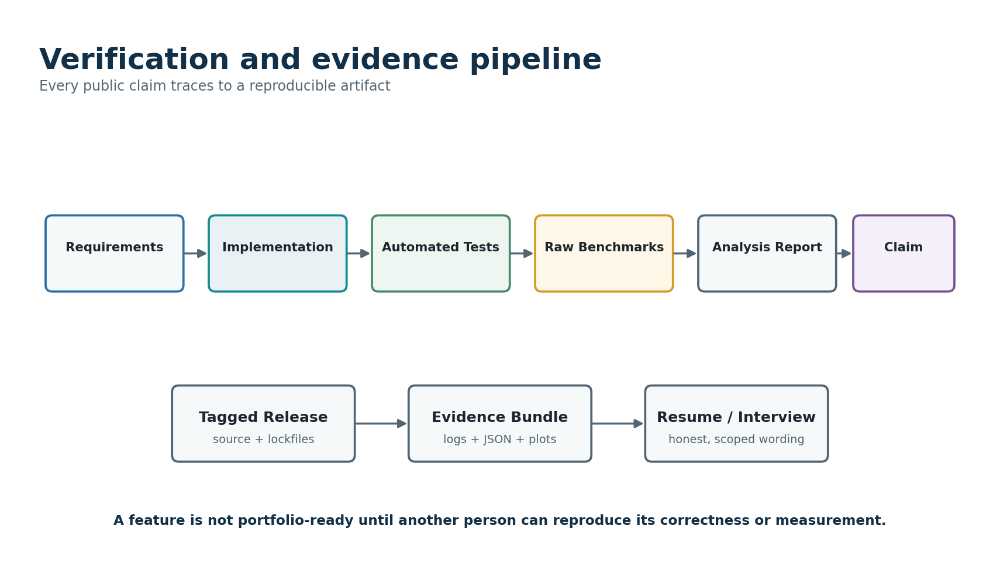

# Part XVIII - Portfolio Evidence, Public Documentation, Demonstrations, and Interview Readiness

## 314. Portfolio Objective

The public Forge repository should function as a compact engineering case study. Its purpose is not to persuade a reviewer that a student recreated a production distributed-compute platform. Its purpose is to make a smaller, precisely scoped system unusually easy to evaluate. A strong reviewer should be able to identify the guarantee, inspect the state transitions that implement it, run a deliberate failure, observe recovery, inspect the measured C++ boundary, and trace every public claim to evidence.

Portfolio quality therefore depends on selection and presentation as much as implementation. A repository with thousands of lines but no reliable entry point creates evaluation cost. Forge should present a layered route: a ninety-second thesis, a five-minute quick demonstration, a twelve-minute failure-and-recovery story, a thirty-minute architecture review, and deep source and evidence paths for specialists.

{width="5.483333333333333in" height="3.2258672353455817in"}

## 315. Reviewer Personas and Their Questions

**Table 108 --- Reviewer personas and evidence paths.**

  ---------------------------------------------------------------------------------------------------------------------------------------------------------------------------------------------------------------------------------------------
  Reviewer                        Time budget      Primary questions                                                                        Forge response
  ------------------------------- ---------------- ---------------------------------------------------------------------------------------- ---------------------------------------------------------------------------------------------------
  Recruiter or general reviewer   1--3 minutes     What is it, why is it difficult, what did the candidate personally build?                Thesis, architecture image, three verified outcomes, languages, link to demo.

  Software engineer               5--15 minutes    Are semantics precise, code readable, tests meaningful, and tradeoffs honest?            Guarantee section, code-reading route, test matrix, ADRs, limitation list.

  Systems engineer                15--45 minutes   How are processes, I/O, persistence, backpressure, clocks, and crashes handled?          State machines, commit protocol, recovery scenarios, bounded queues, perf profiles.

  C++ reviewer                    10--30 minutes   Is the extension necessary, safe, idiomatic, tested, and measured?                       Boundary ADR, ownership diagram, buffer validation, GIL policy, sanitizer and crossover evidence.

  Python reviewer                 10--30 minutes   Does the design use asyncio and multiprocessing deliberately rather than accidentally?   Process model, child supervision, typed contracts, event-loop blocking policy, package quality.

  Performance reviewer            15--45 minutes   Are measurements controlled, reproducible, statistically defensible, and end-to-end?     Frozen manifests, raw evidence, environment capture, repeat trials, profiling, negative results.

  Hiring manager                  5--20 minutes    Does the candidate demonstrate judgment, ownership, communication, and learning?         Milestone history, postmortem, scope decisions, evidence map, concise technical narrative.
  ---------------------------------------------------------------------------------------------------------------------------------------------------------------------------------------------------------------------------------------------

## 316. Repository Landing-Page Information Architecture

1.  **One-sentence thesis.** State that Forge is a deterministic local-first event-replay engine with durable coordination, process-isolated workers, at-least-once execution, exactly-once visible result commits, and a measured C++ accelerator.
2.  **Status badge and release statement.** Show the latest stable tag and which gates are complete. Do not imply unreleased optional work exists.
3.  **Thirty-second architecture.** Include one diagram and a six-step execution flow.
4.  **Guarantees and limits.** Put the execution guarantee, trusted-code boundary, supported platform, and non-goals above the fold.
5.  **Five-minute quick start.** Generate a tiny dataset, run an experiment, inspect status, inject a worker crash, and verify completion.
6.  **Why this is technically interesting.** Name durable state, leases/fencing, conditional commit, recovery, backpressure, native ownership, and benchmark science.
7.  **Evidence summary.** Include implemented test counts only when regenerated; link to raw benchmark and recovery evidence.
8.  **Architecture and source route.** Point to the domain model, coordinator transaction, worker supervisor, protocol decoder, C++ boundary, and failure harness.
9.  **Results.** Present carefully scoped, reproducible measurements with environment and confidence context.
10. **Known limitations and future research.** Make tradeoffs visible before a reviewer has to discover them.
11. **Documentation and references.** Link technical documents, ADRs, postmortems, release notes, and external sources.

## 317. README Opening Draft

    # Forge

    Forge is a deterministic, local-first event-replay and compute engine built with
    Python and C++20. A durable coordinator partitions immutable event datasets,
    leases tasks to process-isolated workers, and conditionally publishes one visible
    result per task. Attempts may execute more than once after crashes or lease expiry;
    stale attempts cannot overwrite the committed result.

    > Guarantee: at-least-once task execution with exactly-once visible result commit
    > for supported local failure scenarios. Forge does not provide exactly-once physical
    > execution, Byzantine fault tolerance, untrusted-code sandboxing, or production
    > multi-tenant isolation.

    ## See it in five minutes

    ```bash
    # Create the environment and build the optional native extension.
    make bootstrap

    # Generate a deterministic 1 GiB or tiny demo dataset.
    forge dataset generate --manifest examples/tiny/dataset.json

    # Start coordinator and two workers in managed demo mode.
    forge demo start --workers 2 --state .forge-demo

    # Submit and follow an experiment.
    forge run submit examples/tiny/experiment.json --follow

    # Re-run a failure scenario and verify final invariants.
    forge scenario run worker-killed-after-output-fsync --seed 17
    forge diagnose verify --run <run-id>
    ```

    The demo intentionally kills a worker after it has staged output but before the
    coordinator commits the attempt. The lease expires, a retry completes, and the
    stale completion is rejected by its fencing epoch. The diagnostic timeline and
    metadata query show why exactly one result became visible.

    ## What this repository demonstrates

    - explicit run/task/attempt/lease/commit semantics and durable state machines;
    - process supervision, cancellation, timeouts, signals, and bounded logging;
    - a versioned framed protocol over Unix-domain sockets with backpressure;
    - immutable datasets and attempt-scoped artifacts with checksums;
    - conditional commit, duplicate execution, restart recovery, and fault injection;
    - a narrow pybind11 C++20 parser/aggregator with explicit buffer and GIL policy;
    - controlled throughput, scaling, memory, and recovery experiments with raw evidence.

    ## Project status

    | Capability | Status | Evidence |
    |---|---|---|
    | Deterministic reference path | implemented / planned | link to Gate A |
    | Durable local coordinator | implemented / planned | link to Gate B |
    | Connected worker protocol | implemented / planned | link to Gate C |
    | C++ accelerator | implemented / planned | link to Gate D |
    | Failure and performance study | implemented / planned | link to Gate E |

    Never mark a row implemented until the linked tag and evidence exist.

## 318. Quick-Start Design Requirements

- The default quick start must use a tiny generated dataset and complete comfortably on a typical laptop.
- The command sequence must not require Docker, cloud credentials, root privileges, manually edited absolute paths, or an external database.
- Every command should be idempotent or explain cleanup. A second run should not fail because the first left a socket or process behind.
- The demo command should manage process groups and guarantee cleanup on normal exit and interruption.
- Expected output should contain stable semantic markers rather than fragile timing-dependent text.
- A `--verbose` or diagnostic mode may expose details, but the default path should remain readable.
- The README must state approximate CPU, memory, disk, and duration requirements without making them performance claims.
- The quick start must verify checksums and final invariants, not merely print "success."
- Installation from the release artifact should be tested separately from editable developer installation.

## 319. Five-Minute Demonstration Script

**Table 109 --- Five-minute demonstration timeline.**

  ----------------------------------------------------------------------------------------------------------------------------------------------------------------------------------------------
  Time                 Action                                                   What the viewer should learn
  -------------------- -------------------------------------------------------- ----------------------------------------------------------------------------------------------------------------
  0:00--0:30           Show thesis and architecture diagram.                    Forge separates durable coordination, immutable data/artifacts, worker processes, and optional native compute.

  0:30--1:15           Generate tiny dataset and inspect manifest/digest.       Inputs are deterministic, versioned, partitioned, and verifiable.

  1:15--2:00           Start coordinator and two workers; show status.          Workers are independent processes with bounded slots and capabilities.

  2:00--3:00           Submit experiment and watch task/attempt transitions.    The coordinator leases deterministic tasks and records durable ownership.

  3:00--4:00           Display result manifest and compare against reference.   Parallel execution preserves deterministic semantic output.

  4:00--5:00           Show evidence links and one limitation.                  Claims are traceable and scope is honest.
  ----------------------------------------------------------------------------------------------------------------------------------------------------------------------------------------------

## 320. Twelve-Minute Failure-and-Recovery Demonstration

1.  **Frame the guarantee (one minute).** State at-least-once execution and exactly-once visible result commit. Explain that retries can run the same task more than once.
2.  **Show durable state before failure (one minute).** Display run, task, attempt, lease epoch, worker, and staged-artifact fields through a read-only status command.
3.  **Arm a named fault point (one minute).** Select `worker-killed-after-descriptor-fsync` or another deterministic scenario and show the scenario manifest and seed.
4.  **Execute and kill (two minutes).** Start the run, let the worker write a complete attempt artifact, then terminate before completion acknowledgement or commit.
5.  **Observe recovery (two minutes).** Show heartbeat deadline, lease expiry, task requeue, new attempt with higher epoch, and successful commit.
6.  **Deliver stale completion (one minute).** Replay or delay the losing completion and show the conditional commit rejection without data corruption.
7.  **Verify artifacts (one minute).** Display committed descriptor, losing attempt disposition, checksums, and canonical result.
8.  **Compare with reference (one minute).** Prove result equality with the sequential oracle.
9.  **Show timeline and invariant report (one minute).** Connect logs, metadata, and state transitions.
10. **Close with limitation (one minute).** Explain that the guarantee covers documented local crash scenarios and does not claim consensus or exactly-once physical execution.

## 321. Thirty-Minute Technical Presentation Outline

**Table 110 --- Thirty-minute technical presentation.**

  -----------------------------------------------------------------------------------------------------------------------------------------------
  Slide                Topic                                Key content
  -------------------- ------------------------------------ -------------------------------------------------------------------------------------
  1                    Problem and thesis                   Why deterministic event replay, why failures, why local-first.

  2                    Guarantee and non-guarantees         At-least-once execution, one visible commit, trusted kernels, single leader.

  3                    System context                       Client, coordinator, workers, dataset/artifact store, metadata.

  4                    Execution vocabulary                 Run, task, attempt, lease, fencing epoch, artifact, commit.

  5                    Deterministic data contract          Fixed event records, manifests, partition IDs, checksums, canonical merge.

  6                    Coordinator transaction boundaries   Submission, assignment, heartbeat, expiry, commit, cancellation.

  7                    Commit protocol                      Attempt staging, validation, conditional transaction, publication, losing attempts.

  8                    Worker and process lifecycle         Spawn, child isolation, signals, logs, resource bounds, cleanup.

  9                    Connected runtime                    Framing, incremental decoder, asyncio, backpressure, reconnect.

  10                   Recovery demonstration               Crash point, restart state, retry, stale completion, invariant verification.

  11                   C++ boundary                         Profile-selected work, batch API, memory ownership, buffer protocol, GIL.

  12                   Verification strategy                Reference oracle, state/model tests, property, fuzz, sanitizers, crash matrix.

  13                   Performance study                    Workloads, environment, scaling, crossover, bottlenecks, uncertainty.

  14                   Difficult bug or negative result     Concrete evidence of debugging and judgment.

  15                   Limitations and next hypothesis      What is intentionally absent and what evidence would justify expansion.
  -----------------------------------------------------------------------------------------------------------------------------------------------

## 322. Guided Code-Reading Route

**Table 111 --- Reviewer code-reading route.**

  ---------------------------------------------------------------------------------------------------------------------------------------
  Stop                 File or module                              Question answered
  -------------------- ------------------------------------------- ----------------------------------------------------------------------
  1                    domain/types.py and semantics.md            What are the stable concepts and guarantees?

  2                    domain/transitions.py                       Which state transitions are legal and why?

  3                    dataset/format.py and reference/engine.py   How are immutable inputs and deterministic outputs defined?

  4                    coordinator/repository.py                   Where are transaction boundaries and constraints?

  5                    coordinator/scheduler.py                    How does a pending task become a leased attempt?

  6                    coordinator/commit.py                       How does fencing prevent stale publication?

  7                    worker/supervisor.py                        How are attempt processes started, cancelled, timed out, and reaped?

  8                    protocol/decoder.py                         How are fragmented and hostile frames bounded?

  9                    cpp_core/bindings.cpp                       What memory crosses the Python/C++ boundary and who owns it?

  10                   faults/scenarios.py                         How are crashes made deterministic and assertions preserved?

  11                   benchmarks/run.py and analysis/             How do raw measurements become public plots?

  12                   docs/adr and postmortems/                   Which alternatives and mistakes shaped the design?
  ---------------------------------------------------------------------------------------------------------------------------------------

## 323. Evidence Bundle Directory

    evidence/
    ├── manifest.json                 # hashes and provenance for every evidence item
    ├── release/
    │   ├── source_tag.txt
    │   ├── toolchain.json
    │   ├── dependencies.json
    │   └── build_transcript.txt
    ├── correctness/
    │   ├── unit_summary.json
    │   ├── property_seeds.jsonl
    │   ├── differential_summary.json
    │   ├── protocol_fuzz_summary.json
    │   └── sanitizer_summary.txt
    ├── recovery/
    │   ├── scenario_catalog.json
    │   ├── crash_matrix.csv
    │   ├── timelines/
    │   ├── database_snapshots/
    │   └── invariant_reports/
    ├── performance/
    │   ├── environment.json
    │   ├── workloads/
    │   ├── raw_trials.jsonl
    │   ├── summaries.csv
    │   ├── profiles/
    │   ├── plots/
    │   └── report.md
    ├── demos/
    │   ├── quick_start.txt
    │   ├── failure_demo.txt
    │   └── expected_digests.json
    └── claims/
        ├── claim_map.csv
        └── resume_claims.md

## 324. Evidence Manifest Schema

    {
      "schema_version": 1,
      "project": "forge",
      "release": "v1.0.0",
      "source_commit": "<full sha>",
      "generated_at_utc": "<ISO-8601>",
      "generator": {
        "command": "forge evidence build --profile release",
        "tool_version": "<version>"
      },
      "environment_digest": "sha256:<digest>",
      "items": [
        {
          "path": "performance/raw_trials.jsonl",
          "media_type": "application/x-ndjson",
          "sha256": "<digest>",
          "bytes": 12345,
          "source_command": "forge benchmark run --manifest ...",
          "inputs": ["sha256:<dataset>", "sha256:<workload>"],
          "claim_ids": ["PERF-001"]
        }
      ]
    }

## 325. Claim Map Requirements

**Table 112 --- Claim map fields.**

  --------------------------------------------------------------------------------------------------------------------
  Field                          Required meaning
  ------------------------------ -------------------------------------------------------------------------------------
  Claim ID                       Stable identifier such as CORR-001, REC-003, PERF-004, or PORT-002.

  Public wording                 Exact sentence or bullet appearing in README, report, talk, or resume.

  Scope                          Platform, dataset, workload, configuration, source tag, and guarantee boundary.

  Evidence                       Files, commands, tests, and raw rows supporting the claim.

  Statistic                      Definition of value, aggregation, sample count, and uncertainty where quantitative.

  Limitations                    Conditions under which the wording would no longer be true.

  Owner review                   Date and release at which the claim was reverified.
  --------------------------------------------------------------------------------------------------------------------

## 326. Example Claim Map

**Table 113 --- Illustrative claim map with placeholders.**

  ----------------------------------------------------------------------------------------------------------------------------------------------------------------------------------------------------------------------------------------------------------------------------------
  ID              Candidate wording                                                                                     Evidence needed                                                         Limitation wording
  --------------- ----------------------------------------------------------------------------------------------------- ----------------------------------------------------------------------- ------------------------------------------------------------------------------------
  CORR-001        Produces canonical results equal to the sequential reference across the published generated corpus.   Differential summary, corpus seeds, output digests, source tag.         Applies to registered kernels and supported schemas, not arbitrary user code.

  REC-001         Retries worker-crashed tasks while preventing stale attempts from replacing committed output.         Crash scenario, lease/commit transaction trace, invariant report.       Local single-leader failure model; exactly-once physical execution is not claimed.

  REC-002         Recovers durable run state after coordinator restart in the documented crash matrix.                  Crash matrix, database snapshots, startup reconciliation logs.          Does not cover storage loss or multi-leader failover.

  PERF-001        Achieved \[X\] events/s with \[N\] workers on \[host\] for workload \[digest\].                       Raw trials, environment, analysis script, source/config/data digests.   No generalization beyond named environment and workload.

  PERF-002        The C++ path improved end-to-end throughput by \[X%\] above batch size \[B\].                         Crossover trials, profiles, identical outputs, confidence summary.      Below crossover, Python may be faster; result is host/workload specific.

  QUAL-001        Passes unit, differential, property, protocol fuzz, sanitizer, integration, and recovery suites.      Release CI evidence and summaries.                                      State exact suite configuration and runtime; do not imply exhaustive proof.
  ----------------------------------------------------------------------------------------------------------------------------------------------------------------------------------------------------------------------------------------------------------------------------------

## 327. Public Performance Presentation Rules

- Lead with the question and workload, not the largest number.
- Put hardware, source tag, configuration, dataset digest, trial count, and statistic near the result.
- Use events per second only with a precise event definition and workload distribution.
- Show end-to-end and component time together when discussing an optimization.
- Report speedup alongside absolute values; speedup without baseline magnitude can mislead.
- Show scaling efficiency, not only total throughput, when increasing worker count.
- Include memory, disk, and CPU context for throughput improvements.
- Avoid latency percentiles unless timing boundaries and sample independence are defensible.
- Do not compare different commits, compilers, datasets, warm-up policies, or host states in one chart without explicit labels.
- Publish neutral and negative results when they explain a design decision.
- Never label a synthetic benchmark "real-world performance."

## 328. Recommended Public Charts

**Table 114 --- Recommended portfolio charts.**

  ---------------------------------------------------------------------------------------------------------------------------------------------------------------------------------------
  Chart                  Axes                                         Purpose                                                 Required annotation
  ---------------------- -------------------------------------------- ------------------------------------------------------- -----------------------------------------------------------
  Worker scaling         workers vs events/s and efficiency           Show useful parallel range and saturation.              Workload, host, trials, result summary, bottleneck.

  Time decomposition     component vs seconds or percentage           Show compute, I/O, scheduler, commit, merge, idle.      Measurement method and overlap caveat.

  Native crossover       batch size vs Python/C++ time or speedup     Show boundary cost and justified batch API.             Equal output proof and build flags.

  Partition sizing       records/task vs throughput/tail/task count   Explain scheduler overhead and load balance tradeoff.   Worker count and dataset size.

  Recovery cost          failure scenario vs completion overhead      Quantify retries and restart impact.                    Fault point, seed, retry count, semantic result equality.

  Memory envelope        workers or dataset vs peak RSS/disk          Show bounded resource behavior.                         Measurement source and process aggregation policy.

  Transport comparison   message size/rate vs latency/CPU             Evaluate UDS/TCP/in-process control path.               Control-plane only; not large data path unless stated.
  ---------------------------------------------------------------------------------------------------------------------------------------------------------------------------------------

## 329. Architecture Documentation Checklist

- Every diagram uses the same domain terms as code and schemas.
- Arrows distinguish control metadata, immutable data references, artifact bytes, heartbeats, and acknowledgements.
- Process and machine boundaries are visible.
- Durable and ephemeral state are visibly different.
- Each state machine identifies transition owner and transaction or event that performs it.
- The commit diagram includes both successful and stale-attempt paths.
- The recovery diagram begins from durable evidence, not from assumed in-memory state.
- The C++ boundary diagram identifies buffer owner, borrowing duration, GIL state, and output ownership.
- Optional features are visually labeled experimental rather than implied to exist.
- Generated diagrams include source files or regeneration commands.

## 330. Technical Decision Record Portfolio

**Table 115 --- Recommended architecture decision records.**

  ------------------------------------------------------------------------------------------------------------------------------------------------
  ADR                  Decision question                                Alternatives that should appear
  -------------------- ------------------------------------------------ --------------------------------------------------------------------------
  ADR-0001             Why local-first and single leader?               Multi-host first, embedded only, external scheduler.

  ADR-0002             What execution and commit guarantee?             At-most-once, at-least-once with idempotent commit, exactly-once claims.

  ADR-0003             Why SQLite WAL for metadata?                     In-memory journal, PostgreSQL, append-only log only.

  ADR-0004             Why immutable file artifacts?                    Database blobs, streamed coordinator results, object store.

  ADR-0005             Why attempt-scoped staging and fencing epochs?   Direct final writes, filename lock, last-writer-wins.

  ADR-0006             Why pull scheduling?                             Push assignment, work stealing, static partition ownership.

  ADR-0007             Why framed UDS control protocol?                 multiprocessing queues, HTTP, gRPC, raw JSON lines.

  ADR-0008             Why process-per-attempt baseline?                Threads, warm process pool, embedded execution.

  ADR-0009             Where should C++ begin and end?                  Full worker in C++, per-record callback, batch parser/aggregator.

  ADR-0010             How should benchmark evidence be stored?         Charts only, benchmark framework output only, normalized raw rows.
  ------------------------------------------------------------------------------------------------------------------------------------------------

## 331. Postmortem Portfolio Requirements

Publish one or two selected engineering postmortems. A postmortem demonstrates more judgment than a list of features because it shows observation, hypothesis, evidence, correction, and prevention.

- Choose a defect that crossed component boundaries, such as a stale completion race, cancellation/commit ordering, leaked child process, partial frame bug, or unsafe borrowed buffer.
- State impact in terms of violated guarantee or resource bound rather than emotional severity.
- Include a minimal reproduction seed, timeline, durable-state snapshot, and relevant logs.
- Identify the missing invariant, test, metric, or review question that allowed the defect.
- Describe rejected hypotheses and the evidence that eliminated them.
- Show the code and contract change, then name the permanent regression test.
- Explain whether the fix introduced a new tradeoff, latency cost, or complexity.
- Avoid blaming tools or concurrency generically; locate the specific ownership or ordering error.

## 332. Hiring-Manager Evaluation Rubric

**Table 116 --- One-hundred-point hiring-manager rubric.**

  -----------------------------------------------------------------------------------------------------------------------------------------------------
  Dimension                         Points               Strong evidence
  --------------------------------- -------------------- ----------------------------------------------------------------------------------------------
  Problem framing and scope         10                   Clear thesis, non-goals, target user, release gates, and honest limitations.

  Execution semantics               12                   Precise identities, state transitions, retries, cancellation, determinism, and guarantees.

  Durability and recovery           14                   Transactional metadata, fencing, conditional commit, restart reconciliation, fault evidence.

  Python systems engineering        10                   Async I/O, process lifecycle, signals, bounds, typing, package quality.

  C++ systems engineering           10                   Narrow justified boundary, ownership, validation, GIL, sanitizers, packaging.

  Protocol and I/O discipline       8                    Framing, incremental decode, limits, backpressure, versioning, reconnect.

  Verification quality              12                   Reference oracle, properties, differential, fuzz, integration, crash matrix, regressions.

  Performance methodology           10                   Frozen workloads, raw evidence, profiles, scaling, uncertainty, honest conclusions.

  Documentation and communication   8                    Readable architecture, demos, ADRs, code route, postmortem, concise explanations.

  Ownership and finish              6                    Clean release, maintained evidence, scope decisions, reviewer usability.
  -----------------------------------------------------------------------------------------------------------------------------------------------------

A project does not need a perfect score to be valuable. For a highly selective systems internship, the strongest differentiator is credible depth across semantics, implementation, failure, measurement, and explanation. A flashy optional feature should not compensate for an undefined commit guarantee or missing recovery test.

## 333. Resume Project Entry --- Target Form

    Forge — Deterministic Distributed Event-Replay and Compute Engine
    Python, C++20, asyncio, multiprocessing, SQLite, Unix sockets, pybind11, CMake

    • Built a local-first compute engine that partitioned immutable event streams across
      process-isolated workers, persisted run/task/attempt state, and recovered eligible
      work after worker or coordinator failure.
    • Designed lease epochs and a conditional commit protocol that allowed at-least-once
      task execution while preventing stale attempts from replacing the one visible result;
      verified the guarantee with [N] deterministic crash and race scenarios.
    • Implemented a bounded framed Unix-socket protocol and a batch-oriented C++20/
      pybind11 parser-aggregator; achieved [verified result] on [named host/workload] while
      preserving byte-equivalent canonical outputs to the Python reference.
    • Published reproducible scaling, memory, and recovery evidence with raw trials,
      environment manifests, sanitizers, differential tests, and documented limitations.

## 334. Resume Bullet Construction Rules

- Begin with the difficult engineering action, not "worked on" or "helped build."
- Name the semantic or systems outcome: durable coordination, process supervision, bounded protocol, conditional commit, deterministic replay, or measured native acceleration.
- Use a number only when its definition, environment, source tag, command, and raw evidence are preserved.
- Avoid "exactly once" without the qualifier "visible result commit" and an explanation of duplicate physical execution.
- Avoid "distributed" if the public release only uses threads or an in-process loop. Independent worker processes over a protocol are sufficient to use the term carefully; name "local-first" when appropriate.
- Avoid "fault tolerant" as an unqualified umbrella. Name the exact worker and coordinator crash scenarios tested.
- Avoid "low latency," "high performance," "production-grade," "secure," or "scalable" unless the claim has a defined comparison and scope.
- Prefer one strong measured outcome and one correctness guarantee over a list of every technology.
- Keep a longer project description for the portfolio and a shorter two- or three-bullet version for the one-page resume.

## 335. Resume Bullet Maturity Levels

**Table 117 --- Truthful resume wording by completed gate.**

  ------------------------------------------------------------------------------------------------------------------------------------------------------------------------------------------------------------------------------------------------------
  Maturity                       Defensible wording
  ------------------------------ -----------------------------------------------------------------------------------------------------------------------------------------------------------------------------------------------------------------------
  Gate A                         Built a deterministic Python event-replay engine with versioned binary datasets, reproducible partitioning, registered kernels, canonical merge, and differential tests against an independent reference.

  Gate B                         Built a durable local compute engine that scheduled immutable partitions across process-isolated workers and recovered work after documented worker/coordinator failures using leases and conditional result commits.

  Gate C                         Designed a bounded, versioned Unix-socket protocol for independently launched workers, including incremental framing, heartbeats, reconnects, and backpressure tests.

  Gate D                         Implemented a batch-oriented C++20/pybind11 parser or aggregator with explicit buffer/GIL policy, sanitizer coverage, differential testing, and a published native crossover study.

  Gate E/F                       Quantitative claims may be added only from the frozen evidence bundle; retain host, workload, trial count, and limitation in the linked project page.
  ------------------------------------------------------------------------------------------------------------------------------------------------------------------------------------------------------------------------------------------------------

## 336. Five Core Interview Stories

**Table 118 --- Core interview story library.**

  ---------------------------------------------------------------------------------------------------------------------------------------------------------------------------------------------------------------------------------------
  Story                                Prompt it answers                                                                               Evidence sequence
  ------------------------------------ ----------------------------------------------------------------------------------------------- --------------------------------------------------------------------------------------------------
  Story 1 --- Guarantee design         Why at-least-once execution with exactly-once visible commit was chosen.                        Requirements ambiguity, alternatives, fencing epoch, transaction, race tests, limitation.

  Story 2 --- Hard concurrency bug     A stale completion, cancellation race, or leaked process found through deterministic testing.   Timeline, violated invariant, hypotheses, fix, regression, operational signal.

  Story 3 --- C++ boundary decision    How profiling selected the batch API and why per-event binding was rejected.                    Baseline profile, ownership/GIL design, correctness oracle, crossover evidence, negative region.

  Story 4 --- Performance bottleneck   Why scaling stopped and what experiment isolated the cause.                                     Frozen workload, decomposition, perf evidence, optimization, tradeoff, honest result.

  Story 5 --- Scope and ownership      A feature deliberately cut to protect correctness and release quality.                          Risk, critical path, decision rule, achieved gate, future hypothesis.
  ---------------------------------------------------------------------------------------------------------------------------------------------------------------------------------------------------------------------------------------

## 337. STAR Story Worksheet

    # Story: <specific engineering decision or defect>

    ## Situation
    What system state, guarantee, user need, or measured problem existed? Use enough
    context to explain stakes, but do not spend most of the answer here.

    ## Task
    What outcome did you personally own? State the constraint or acceptance criterion.

    ## Action
    1. How did you make the problem observable?
    2. What hypotheses or alternatives did you consider?
    3. What design, experiment, or test did you implement?
    4. How did you verify correctness and prevent recurrence?
    5. What tradeoff did you accept?

    ## Result
    Use verified evidence: state restored, invariant preserved, crash matrix passed,
    measured bottleneck changed, or scope was reduced successfully. Include a number
    only when its definition is defensible.

    ## Reflection
    What remains limited? What would you do differently in a production or multi-host
    system? What did this change about your engineering process?

## 338. Interview Question Bank --- Product and Semantics

**Table 119 --- Interview questions on product and execution semantics.**

  ---------------------------------------------------------------------------------------------------------------------------------------------------------------------------------------------------------------------------------------------------------------------------
  Question                                                                        Strong answer ingredients
  ------------------------------------------------------------------------------- -------------------------------------------------------------------------------------------------------------------------------------------------------------------------------------------
  What exactly does Forge guarantee?                                              State at-least-once task execution, one visible committed artifact per task, deterministic supported kernels, and documented local failure scope.

  Why not claim exactly-once execution?                                           A worker may finish after lease expiry or lose an acknowledgement; preventing duplicate physical work would require stronger coordination and still interacts with external side effects.

  What makes an experiment reproducible?                                          Immutable input digest, generator version, partition plan, kernel ID/version/parameters, source/config version, canonical merge, and normalized result manifest.

  What is the difference between task and attempt?                                Task is the logical partition computation; attempt is one physical execution authorized by a lease epoch.

  Why are outputs attempt-scoped?                                                 Duplicate attempts must never write the same mutable path; staging preserves provenance and lets the coordinator choose the winner.

  What happens when a worker completes after its lease expires?                   Artifact may be valid but its commit authorization is stale; conditional transaction rejects visibility and cleanup policy handles the losing output.

  How does cancellation interact with commit?                                     State predicate defines whether already-authorized completion can commit; the chosen barrier and both orderings must be documented and tested.

  How do you distinguish deterministic output from byte-identical run metadata?   Normalize ephemeral fields; semantic output and canonical manifests are compared separately from timestamps and local paths.

  Can a kernel have side effects?                                                 Public model should prohibit or explicitly constrain external side effects because retries can duplicate them; trusted kernels should write only attempt-scoped outputs.

  Why immutable datasets?                                                         They make partition descriptors, cache validation, replay, checksums, and failure recovery tractable.

  What makes a run terminal?                                                      All tasks have one allowed terminal outcome and merge/publication has completed or failed according to the run state contract.

  What would change for a DAG engine?                                             Dependencies, dynamic task release, lineage, partial recomputation, cycle validation, and more complex cancellation/recovery; intentionally out of scope.
  ---------------------------------------------------------------------------------------------------------------------------------------------------------------------------------------------------------------------------------------------------------------------------

## 339. Interview Question Bank --- Coordinator, Persistence, and Recovery

**Table 120 --- Interview questions on coordinator and recovery.**

  --------------------------------------------------------------------------------------------------------------------------------------------------------------------------------------------------------------------
  Question                                                      Strong answer ingredients
  ------------------------------------------------------------- ------------------------------------------------------------------------------------------------------------------------------------------------------
  Why SQLite?                                                   Local-first scope, transactional constraints, inspectability, WAL readers, simple deployment; acknowledge single-writer and multi-host limitations.

  What belongs in one assignment transaction?                   Select eligible task, create attempt, increment/assign fencing epoch, set lease, associate worker, and transition task atomically.

  What belongs in one commit transaction?                       Validate task/attempt/epoch/state, register artifact identity, set one committed result, transition task, and reject duplicates/stale attempts.

  Why is an acknowledgement not proof of commit?                Network response can be lost after durable transaction; retry must query or repeat idempotently.

  How does coordinator restart recover in-flight work?          Read durable states, classify leases conservatively, reconcile artifacts, expire/retry eligible attempts, and never assume old in-memory ownership.

  What is a fencing token?                                      A monotonically increasing authorization value that lets the resource reject operations from stale lease holders.

  Why not rely only on wall-clock lease deadlines?              Clock jumps and restart ambiguity; use monotonic deadlines live and persist enough conservative metadata/epochs for recovery.

  What if the database commits but artifact rename fails?       Chosen publication order and reconciliation must define intermediate state; never label task committed until visible artifact contract is satisfied.

  What if artifact rename succeeds but database commit fails?   Artifact remains unreferenced/staged or orphaned and is reconciled/garbage-collected; it cannot become authoritative by filename alone.

  How do you prevent duplicate run submission?                  Client request identity or deterministic submission key under uniqueness constraint and idempotent lookup.

  How are retries limited?                                      Error classification, maximum attempts, backoff, run policy, and terminal task failure; non-retryable validation errors fail immediately.

  How would PostgreSQL change the design?                       Repository implementation, locking/isolation and deployment change; domain semantics and conditional predicates should remain.
  --------------------------------------------------------------------------------------------------------------------------------------------------------------------------------------------------------------------

## 340. Interview Question Bank --- Python Processes and Async I/O

**Table 121 --- Interview questions on Python systems engineering.**

  -----------------------------------------------------------------------------------------------------------------------------------------------------------------------------------------------------------
  Question                                                 Strong answer ingredients
  -------------------------------------------------------- --------------------------------------------------------------------------------------------------------------------------------------------------
  Why processes instead of threads for kernel execution?   CPU-bound Python, isolation, cancellation and crash containment; acknowledge startup and serialization cost.

  Why use spawn-compatible startup?                        Avoid inherited unsafe state and make process contracts explicit; improves portability and deterministic initialization.

  How do you stop a child safely?                          Cooperative request, grace deadline, terminate, kill, wait/reap, classify exit, clean temp resources.

  How do you prevent zombies?                              Single supervisor owns each child, waits on every terminal path, and soak tests process counts.

  What can block the asyncio event loop?                   SQLite/file operations, large encoding, merge, subprocess waits; measure lag and offload or chunk bounded work.

  How is backpressure implemented?                         Bounded assignment and socket queues, awaitable capacity, read pause or rejection, slow-peer timeout.

  What is cancelled when an asyncio task is cancelled?     Only the coroutine unless cleanup propagates explicitly; shield/try-finally semantics and process cleanup must be designed.

  Why not use multiprocessing.Queue everywhere?            Fine for baseline, but hides framing/versioning and complicates independent processes/multi-host experiment; still a valid rejected alternative.

  How do workers reconnect without duplicating work?       Session identity is ephemeral, durable attempt identity and request idempotency are authoritative, leases handle uncertainty.

  How are worker logs bounded?                             Byte caps, rotating files or truncation markers, nonblocking drain, metadata counters.

  What does the GIL affect here?                           Python bytecode threads, extension call behavior, and C++ parallel opportunity; processes already isolate Python kernels.

  How would you debug a hung worker?                       Status, heartbeat, child process tree, stack/trace tools, queue metrics, diagnostic bundle, timeout fault reproduction.
  -----------------------------------------------------------------------------------------------------------------------------------------------------------------------------------------------------------

## 341. Interview Question Bank --- Protocols and Networking

**Table 122 --- Interview questions on protocol and networking.**

  -------------------------------------------------------------------------------------------------------------------------------------------------------------------------------------------
  Question                                         Strong answer ingredients
  ------------------------------------------------ ------------------------------------------------------------------------------------------------------------------------------------------
  Why frame messages?                              Stream sockets do not preserve message boundaries; header defines length, type, version, and bounded decode.

  What does an incremental decoder retain?         Partial header/payload bytes and expected length; it may emit zero, one, or many frames per read.

  How do you handle an advertised 4 TB payload?    Reject header before allocation using hard maximum and close/error policy.

  What happens on partial write?                   Queue remaining bytes and resume on writable readiness; never assume send transmits entire frame.

  How are duplicate requests handled?              Request IDs plus semantic idempotency; cache or durable lookup for side-effecting operations.

  Why UDS before TCP?                              Local-first, lower deployment/security burden, independent processes, same framing; TCP remains optional experiment.

  How do you authenticate workers?                 UDS permissions/peer credentials locally; multi-host needs explicit TLS or shared credentials and is not implied by local mode.

  How do you version the protocol?                 Major incompatibility rejection, minor capability negotiation, reserved fields, golden fixtures, compatibility matrix.

  What is head-of-line blocking here?              One large frame or slow handler can delay subsequent control messages; size limits, message separation, and bounded processing mitigate.

  Why not JSON lines?                              Readable but framing/escaping/size and numeric constraints; could be a valid baseline if bounded. Explain actual chosen tradeoff.

  What should happen to an unknown message type?   Version-aware stable error or close policy; never reinterpret silently.

  How do you fuzz the protocol?                    Feed arbitrary bytes/chunks to decoder, enforce no crashes/unbounded allocation, preserve seed corpus and sanitizer integration.
  -------------------------------------------------------------------------------------------------------------------------------------------------------------------------------------------

## 342. Interview Question Bank --- C++ and Python/C++ Boundary

**Table 123 --- Interview questions on C++ integration.**

  ---------------------------------------------------------------------------------------------------------------------------------------------------------------------------------------------------
  Question                                              Strong answer ingredients
  ----------------------------------------------------- ---------------------------------------------------------------------------------------------------------------------------------------------
  Why C++ at all?                                       Profile-selected parser/aggregation cost, systems learning, and measured crossover; preserve Python fallback.

  Why batch calls?                                      Amortize binding and conversion overhead, improve contiguous access, and keep ownership/GIL policy tractable.

  Who owns an input buffer?                             State exact API: borrowed only for call while owner is held, or copied/owned; no dangling views.

  When can the GIL be released?                         After Python objects and buffers are validated and stable; no Python API access until reacquired.

  How do exceptions cross the boundary?                 Map typed C++ errors to stable Python exceptions without leaking internal or partial state.

  How do you prevent integer overflow?                  Checked conversions, range validation, size arithmetic before allocation/indexing.

  How do you compare native and Python correctness?     Independent reference, canonical outputs, generated and malformed corpora, exact or tolerance-defined comparison.

  What do ASan and UBSan cover?                         Memory errors and undefined behavior in instrumented native code; acknowledge they do not prove absence of all concurrency/logical defects.

  Why not expose per-event Python callbacks from C++?   GIL and call overhead, complex exceptions/lifetimes, destroys batch benefit.

  How do build types affect benchmarks?                 Debug/sanitizer builds are for correctness, optimized release with recorded flags for performance; never compare across them silently.

  What optimization did you reject?                     Use actual profile/experiment and explain neutral or negative end-to-end result.

  How would SIMD change portability?                    Feature detection, scalar fallback, alignment, compiler/architecture labels, separate evidence.
  ---------------------------------------------------------------------------------------------------------------------------------------------------------------------------------------------------

## 343. Interview Question Bank --- Testing and Fault Injection

**Table 124 --- Interview questions on verification and failure injection.**

  -------------------------------------------------------------------------------------------------------------------------------------------------------------------------------------------------
  Question                                               Strong answer ingredients
  ------------------------------------------------------ ------------------------------------------------------------------------------------------------------------------------------------------
  Why keep a slow reference engine?                      Stable oracle for optimized/distributed paths and generated differential testing.

  What properties are more useful than examples?         One committed result/task, canonical partition coverage, no overlapping ranges, stale epoch rejected, retry bounds, deterministic merge.

  How do you avoid flaky timing tests?                   Named barriers, fake clocks where appropriate, injected events, deterministic seeds, bounded eventual assertions.

  What is the most important crash point?                There is no universal one; explain write/fsync/transaction/rename/ack boundaries and chosen protocol.

  How do you test both sides of a race?                  Deterministic hooks pause each actor before commit/cancel/expiry and force order A→B and B→A.

  What should a soak test assert?                        No invariant failures, bounded memory/FD/process/disk, progress, cleanup, stable error rate.

  How do you preserve a discovered concurrency defect?   Seed, scenario manifest, reduced timing barriers, state snapshot, permanent regression.

  Why fuzz both Python and C++ decoders?                 Different implementations and memory-safety risks; same wire corpus can expose divergence.

  What does differential testing miss?                   Shared wrong assumptions, untested schema space, nondeterministic effects; use independent implementation and properties.

  How do you test recovery from metadata corruption?     Detect and fail explicitly; do not silently repair unless deterministic, audited policy exists.

  How do you test full disk?                             Inject write/fsync failure or use bounded filesystem fixture; assert no false commit and clear operator state.

  What is a test oracle for cancellation?                Written state contract: assignment barrier, allowed terminal task states, artifact visibility, child termination, idempotent repeat.
  -------------------------------------------------------------------------------------------------------------------------------------------------------------------------------------------------

## 344. Interview Question Bank --- Performance and Measurement

**Table 125 --- Interview questions on performance methodology.**

  ----------------------------------------------------------------------------------------------------------------------------------------------------------------
  Question                                           Strong answer ingredients
  -------------------------------------------------- -------------------------------------------------------------------------------------------------------------
  Why did scaling stop?                              Use measured compute/I/O/coordination/serialization/memory bandwidth decomposition, not generic "overhead."

  How did you choose partition size?                 Trade scheduler overhead, load balance, cache/I/O behavior, recovery granularity, and result count.

  Why report raw trials?                             Allow alternate statistics, outlier review, reproducibility, and claim audit.

  How did you control warm-up?                       State cache/process/native initialization policy and whether warm or cold behavior is the question.

  What statistic did you use?                        Median/mean/percentile with trial count and reason; distinguish across-run from per-event distributions.

  How do you measure peak memory across processes?   Define aggregation and sampling source; avoid reporting coordinator RSS as system total.

  How do you know C++ helped end-to-end?             Same workload/output, total elapsed comparison, component decomposition, crossover, multiple trials.

  What is a negative result worth publishing?        Shared memory/TCP/compression/optimization that did not improve the measured bottleneck and why.

  How would CPU affinity affect results?             Reduces migration/noise but changes environment; record policy and do not hide it.

  Can events per second compare different kernels?   Not meaningfully without same event definition and work; label kernel/workload.

  How do failures affect benchmark validity?         Separate fault-free throughput from recovery workloads; record retry counts and semantic equality.

  What would you measure next?                       Name the largest unexplained component and a controlled experiment, not a favorite technology.
  ----------------------------------------------------------------------------------------------------------------------------------------------------------------

## 345. Whiteboard and Coding Exercises Derived from Forge

**Table 126 --- Forge-derived interview coding and design exercises.**

  ----------------------------------------------------------------------------------------------------------------------------------
  Exercise                       Core challenge
  ------------------------------ ---------------------------------------------------------------------------------------------------
  Incremental frame decoder      Parse a byte stream into bounded frames while handling arbitrary chunks and invalid lengths.

  Lease table                    Design operations for assign, heartbeat, expire, retry, and stale completion.

  Conditional commit             Write transaction pseudocode or SQL that preserves one committed artifact per task.

  Partition planner              Split N fixed records into deterministic balanced partitions with stable IDs and overflow safety.

  K-way deterministic merge      Merge sorted partition results with bounded memory and tie-breaking.

  Worker supervisor              Design process start, timeout, cancellation, kill, reap, and outcome classification.

  Bounded queue                  Implement producer/consumer flow control and shutdown semantics.

  State-machine validator        Reject illegal task transitions and make idempotent repeats safe.

  Artifact checksum stream       Compute and validate digest while copying with partial read/write handling.

  C++ buffer view                Validate shape/stride/item size and sum fields safely under an explicit lifetime.

  Retry policy                   Classify retryable errors and implement capped exponential backoff with jitter.

  Scaling analysis               Given trial data, calculate speedup/efficiency and identify the likely saturation point.
  ----------------------------------------------------------------------------------------------------------------------------------

## 346. Common Reviewer Red Flags

**Table 127 --- Portfolio red flags and corrections.**

  ----------------------------------------------------------------------------------------------------------------------------------------------------------------------------------------
  Red flag                                     Why it weakens the project                                           Correction
  -------------------------------------------- -------------------------------------------------------------------- ----------------------------------------------------------------------
  "Exactly once" with no qualifier             Suggests misunderstanding of duplicate execution and side effects.   Name one-visible-result guarantee and show stale-attempt test.

  C++ listed but isolated to trivial wrapper   Language signal lacks systems depth or measured need.                Show ownership, validation, GIL, sanitizers, and crossover evidence.

  Only happy-path demo                         Distributed value is unproven without failure behavior.              Make a deterministic crash and recovery part of the primary demo.

  Benchmarks without raw data or host          Numbers cannot be audited or interpreted.                            Publish manifests, trials, environment, and analysis code.

  Large dependency stack                       Core engineering may be hidden behind frameworks.                    Keep dependencies narrow and explain every one.

  Unbounded queues or logs                     Shows missing resource reasoning.                                    Declare caps, metrics, and overload policy.

  Unsafe pickle over TCP                       Contradicts secure systems judgment.                                 Use bounded schemas and trusted local boundary.

  UI before semantics                          Polish distracts from undefined guarantees.                          Complete Gate B/C and evidence first.

  No limitations section                       Forces reviewer to infer weaknesses and distrust claims.             State platform, failure model, trust, and scale boundaries directly.

  Resume numbers not found in repository       Damages credibility.                                                 Use claim map and immutable evidence links.
  ----------------------------------------------------------------------------------------------------------------------------------------------------------------------------------------

## 347. Public Release Checklist

**Table 128 --- Public release checklist.**

  --------------------------------------------------------------------------------------------------------------------------------------------------------
  Area                           Release condition
  ------------------------------ -------------------------------------------------------------------------------------------------------------------------
  Scope and truth                Status table matches tagged implementation; optional features are labeled; guarantees and non-guarantees are prominent.

  Source hygiene                 No secrets, private data, personal absolute paths, editor artifacts, generated junk, or oversized untracked evidence.

  Licensing                      Project license, dependency licenses, dataset provenance, and third-party notices are present.

  Build                          Clean checkout installs from release artifact with documented supported toolchain.

  Tests                          Required unit, property, differential, native, integration, recovery, and package suites pass.

  Sanitizers/fuzz                Release evidence records configurations, runtime, and findings; corpus is preserved.

  Demo                           Tiny happy-path and named failure demo complete and clean up automatically.

  Operations                     Start, stop, status, drain, cancel, retry, diagnose, verify, and GC commands are documented.

  Evidence                       Manifest, digests, raw measurements, environment, source tag, and generation commands are complete.

  Claims                         README, report, talk, and resume wording are checked against claim map.

  Documentation                  Diagrams, schemas, message names, state transitions, examples, and command output match release.

  Accessibility                  Diagrams have descriptive text, tables have headings, and documentation does not depend only on color.

  Reviewer experience            Quick start tested by another person; common failure messages include next action.

  Maintenance                    Supported versions, issue policy, security reporting, and deferred scope are clear.
  --------------------------------------------------------------------------------------------------------------------------------------------------------

## 348. Maintenance During Recruiting

- Protect the stable release tag. Continue work on main or a future milestone without rewriting evidence behind submitted applications.
- Re-run the clean-build and quick demo after dependency updates; do not let the repository silently rot.
- Respond to correctness and build defects before adding new features.
- Keep benchmark claims attached to their original release and environment; a newer commit does not automatically inherit old numbers.
- Maintain a small list of known issues with severity and workaround.
- Do not accept broad feature contributions that compromise the teaching narrative or critical guarantees.
- Before an interview, rehearse from the exact public tag and confirm links and evidence still resolve.
- After recruiting, archive a stable portfolio branch before beginning major architectural experiments.

## 349. Portfolio Completion Test

Forge is portfolio-complete when a technically skeptical reviewer can answer all of the following from the release without private explanation:

- What problem does Forge solve and what does it deliberately not solve?
- What are the logical task and physical attempt, and why can attempts duplicate?
- What exactly makes one result visible and why can a stale attempt not replace it?
- What durable evidence survives coordinator restart?
- How are worker processes started, cancelled, timed out, and reaped?
- How are protocol messages framed, bounded, versioned, and backpressured?
- What memory crosses into C++, who owns it, and when is the GIL released?
- Which failure scenarios are automated, and where are their invariant reports?
- How were benchmarks controlled, and where are raw trials and environment details?
- Which claims are supported, which are placeholders, and which capabilities remain out of scope?
